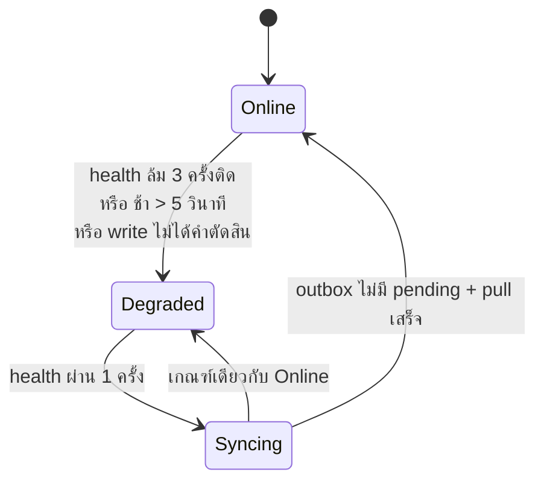

# 08 — Phase 2 spec: offline shell + production ในมหาวิทยาลัย

> **เอกสารเจ้าของสเปกเฟส 2** (Architecture C — `03_ARCHITECTURE.md §4`)
> ที่มา: เจ้าของโปรเจกต์ #240 — **D1–D15** (รอบ 1) และ **E1–E11** (รอบ 2, comment ใน #240) — **E ชนะ D เมื่อขัดกัน** · host: #242 (owner 2026-09-15) · แผนที่งาน #243 · review ของ PR #254
> ADR ที่แก้ตาม: [0004](adr/0004-device-roles.md) · [0007](adr/0007-receipt-numbering.md) · [0009](adr/0009-jwt-session-lifetime.md) · [0010](adr/0010-client-write-through-cache.md) · [0013](adr/0013-cicd-toolchain.md)
> **ขัดกับ ADR → ยึด ADR** · เหตุผลยาว ๆ อยู่ใน ADR ไฟล์นี้เก็บแค่กติกา + ตัวอย่าง + เกณฑ์รับงาน
>
> 🔴 **ห้ามแต่งข้อความไทยใหม่** (`02 §8.1`) — ข้อความที่ยังไม่มีคำอยู่ §18 Q1 · ข้อความในเครื่องหมายคำพูดในไฟล์นี้เป็น**คำอธิบาย ไม่ใช่ข้อความหน้าจอ**

สถานะ 2026-09-15: ร่างรอบ 2 (หลัง E1–E11 + review) · ยังไม่มีโค้ด

---

## 0. สรุปหน้าเดียว

| เรื่อง | กติกา | ที่มา |
|---|---|---|
| บทบาทคน | **`owner` role เดียว + บัญชีร้านบัญชีเดียว** · guard ที่เช็ค role คนหายหมด · device role `pos`/`backoffice` เหมือนเดิม | E1, E2 |
| เปิดแอปไม่มีเน็ต | PWA + service worker เขียนเอง เสิร์ฟจาก nginx | D2, #241 |
| แท็บ | เครื่อง `pos` แท็บเดียว (Web Locks) | D10 |
| สถานะ | Online / Degraded / Syncing + ป้าย "มีรายการถูกปฏิเสธ" | D5, review |
| ขายออฟไลน์ | สต็อกในเครื่องพอก็ขายได้ · **ไม่มี `offlineOk`** (ลบคอลัมน์) | D3, E10 |
| op ที่เข้าคิว | ขาย · คืน · รายการลิ้นชัก · เปิดกะ · ชำระเครดิตช่าง · สร้าง/แก้ลูกค้า · void บิลที่ขายออฟไลน์ · override วงเงิน | E6 |
| ออนไลน์เท่านั้น | สินค้า · หมวด · ซัพพลายเออร์ · PO · ช่าง (สร้าง/แก้/ลบ) · ใบเสนอราคาทั้งหมด · settings · การลบ · void บิลออนไลน์ · ปิดกะ | E6 |
| พักบิล | **อยู่ในเครื่องอย่างเดียว ไม่ sync** | E6 |
| เลข RC/CN | เครื่อง `pos` ออกเอง ออนไลน์+ออฟไลน์ · ขึ้นเดือนใหม่ออฟไลน์เริ่ม `0001` | D4, E8 |
| วันที่บิล | นาฬิกาเครื่อง · server clamp + ติดธง | E9 |
| กะ | หลายกะต่อวัน · เปิดออฟไลน์ได้ · ปิดต้องออนไลน์ + outbox ว่าง + ไม่มีรายการถูกปฏิเสธ · กะที่ไม่ได้ปิด = archive "ไม่ได้นับเงิน" | E7 |
| void | ออนไลน์: เหตุผลบังคับ ไม่มี PIN · ออฟไลน์: เฉพาะบิลที่ขายออฟไลน์ + เหตุผล → รายการตรวจ | E3, E4 |
| PIN ออฟไลน์ | 1 PIN ต่อเครื่อง `pos` · ต้องไม่ซ้ำรหัสผ่านออนไลน์ · 3 วัน · Degraded เท่านั้น | E5 |
| หน้าจอ | หน้า "รอ owner" หน้าเดียว 2 แท็บ: ถูกปฏิเสธ / รอตรวจ · discard = ออนไลน์ + หมายเหตุ + `audit_log` | E10 |
| production | `mob04` สภาพแวดล้อมเดียว · deploy ด้วย self-hosted runner บน `mob04` | #242, E11 |

---

## 1. ขอบเขต

| อยู่ในเฟส 2 | ไม่อยู่ |
|---|---|
| offline shell (PWA + Drift + outbox), `POST /sync/push`, เลข RC/CN ที่เครื่อง, PIN ออฟไลน์, หน้า "รอ owner", production บน `mob04` | cutover ร้านจริงจากนอกมหาวิทยาลัย (#231 — เฟสถัดไป; ผลเทียบ cloud อยู่ branch `research/production-host`) · หลาย `pos` ต่อร้าน · `change_log`/CRDT (#191) · CouchDB (ADR-0012) · ใบกำกับภาษีเต็มรูป |

ข้อเท็จจริงที่ทั้งไฟล์ยืนอยู่: ร้านมี `pos` **เครื่องเดียว** (`one_pos_per_tenant`) = ผู้ขาย ผู้ถือลิ้นชัก และผู้ออก RC/CN คนเดียว ความขัดแย้งจึงมาจาก `backoffice` แก้ข้อมูลระหว่างเครื่อง `pos` ออฟไลน์เท่านั้น

---

## 2. Blocker decisions (owner to confirm)

การตัดสินใจทางออกแบบที่ spec นี้เลือกเอง (ทางที่ง่ายที่สุดที่ยังปลอดภัย ตรวจกับโค้ดแล้ว) — เจ้าของอ่านแล้ว**ยืนยันหรือค้าน**ได้ทีละแถว

| # | ปัญหา (review) | เลือก | ตัดทิ้ง (1 บรรทัด) |
|---|---|---|---|
| **B1** 🔴 | ตรวจก่อน replay → บิลที่ commit แล้วถูกปฏิเสธแล้วโดน discard ว่า "ไม่เคยเขียน" | ทุก op: **replay ด้วย key → replay ด้วย client id → ค่อยตรวจ** (§8.3) · replay คืนผลเดิมโดยไม่ตรวจอะไรเลย | ตรวจก่อนแล้วยกเว้นบาง code — ต้องจำรายการยกเว้น ลืมตัวเดียวก็พัง |
| **B2** 🔴 | key หมดอายุ 24 ชม. (`idempotency.service.ts:28`) สั้นกว่าช่วงออฟไลน์ | **ทุก op ที่สร้างแถวพก client id (PK ของแถว) และ server replay ด้วย id นั้น** (แพทเทิร์น `existingSale` / `existingPayment` #20/#24) · id ซ้ำแต่เนื้อหาต่าง → `rejected` `*_ID_REUSED` | ยืด TTL ของ key — ช่วงออฟไลน์ไม่มีเพดาน (เครื่องอาจค้าง Degraded กี่วันก็ได้) และตาราง key บวม |
| **B3** 🔴 | `retry` กลาง batch → op หลังวิ่งก่อน (void บิลที่ยังไม่ขึ้น → บิลค้าง live) | **server ทำตามลำดับ หยุดที่ผลแรกที่ไม่ใช่คำตัดสิน** แล้วตอบ op ที่เหลือเป็น `retry` โดยไม่ประมวลผล · client ส่งทีละคำขอเดียว (§8.4) | ประมวลผลต่อแล้วให้ op ที่พึ่งกันล้มเอง — ทำให้บิลที่ยกเลิกแล้วกลับมามีชีวิต · กราฟพึ่งพาต่อ op — ซับซ้อนเกิน |
| **B4** 🔴 | cursor ของ pull มาจาก `MAX(updatedAt)` ในเครื่อง (`api_products_repository.dart:76`) = นาฬิกาเครื่อง | **cursor = `meta.nextCursor` ของ server เก็บใน Drift ต่อ entity** · ถอย 30 วินาที **ครั้งเดียวต่อรอบ pull** (หน้าแรก) · ห้าม derive จากแถวในเครื่อง (§15) | ใช้เวลาในเครื่อง — เครื่องนาฬิกาเร็วข้ามการแก้ของ backoffice ถาวร · `change_log` — #191 ตีตกแล้ว |
| C1 | วันที่บิล (E9) | route ออนไลน์: `date = now()` ของ server (ไม่อ่าน `date` ใน body) · ทาง push: `date` ของเครื่อง clamp เข้า `[shift.opened_at, now()]` · ต่างเกิน 5 นาที → รายการตรวจ `date_flag` | ติดธงบิลออนไลน์ด้วย — นาฬิกาคลาดไม่กี่วินาทีก็ติดธงทุกบิล |
| C2 | period ในเลขเอกสารไม่ตรงเดือนของวันที่บิล | **ไม่ปฏิเสธ** (ใบเสร็จพิมพ์แล้ว) → รายการตรวจ `date_flag` | ปฏิเสธ `DOC_NUMBER_INVALID` — ตีกลับใบที่ลูกค้าถือไปแล้ว |
| C3 | server แยกไม่ออกว่า void เกิดออฟไลน์จริงไหม (review 🟠7) | `sales.sold_offline = true` เมื่อบิล **commit ครั้งแรกผ่าน `/sync/push`** · `sale.void_offline` รับเฉพาะบิลที่ `sold_offline` | เชื่อป้ายจากเครื่อง — ปลอมได้ |
| C4 | PIN ออฟไลน์ต้องไม่ซ้ำรหัสผ่าน (E5) โดยไม่ส่ง PIN ไปไหน | หน้าตั้ง PIN ให้พิมพ์รหัสผ่านอีกครั้ง → เรียก **`POST /auth/token` ตัวเดิม** (rate limit + audit มีแล้ว) → ผ่านแล้วเทียบ `PIN != รหัสผ่าน` ในหน่วยความจำ แล้วล้างทิ้ง | endpoint ตรวจใหม่ — ของเพิ่มโดยไม่จำเป็น · ส่ง PIN/hash ขึ้น server — ผิด #187 |
| C5 | เวลาล็อกอินออนไลน์ล่าสุดมาจาก audit ที่เขียนแบบกลืน error (`auth.service.ts:404-411`) | คอลัมน์ **`devices.last_online_login_at`** เขียนโดย `/auth/token` · เขียนไม่สำเร็จ = ล็อกอินไม่สำเร็จ | อ่านจาก `audit_log` — แถวหายเงียบได้ แล้ว op ออฟไลน์ 3 วันถูกปฏิเสธหมด |
| C6 | ของที่ต้องให้ owner ตรวจมี 4 ชนิด | **ตารางเดียว `owner_review_items`** (`kind`, `ref_id`, `details`, `reviewed_at`) เขียนใน transaction ของ op | คอลัมน์ต่อชนิดบน `sales`/`shifts` + endpoint ต่อชนิด |
| C7 | `customer.update` ที่ commit แล้ว replay หลัง key หมดอายุ | **ยอมรับ**: เขียนค่าเดิมซ้ำ อาจทับการแก้ของ backoffice ที่เกิดระหว่างนั้น (หายาก) | version/`baseUpdatedAt` — เพิ่ม conflict path ให้ข้อมูลที่ไม่ใช่เงิน |
| C8 | เลขเอกสารขาดช่วง | เลขถูก "ใช้" เมื่อ server ตอบ 2xx หรือเมื่อบิลเข้าคิวเท่านั้น · 4xx ออนไลน์ (ยังไม่พิมพ์) ใช้เลขเดิมซ้ำ | บิลที่ถูกปฏิเสธกินเลขทิ้ง — ได้ช่องว่างในชุดเลข |
| C9 | ไม่มีใครใช้ `users.pin_hash` แล้ว (E3/E10) | **ลบคอลัมน์** ใน slice 1 | เก็บไว้ไม่ใช้ |
| C10 | ตัวกระตุ้น Degraded (D5 + review 🟡) | ล้ม 3 ครั้งติด **หรือ** ตอบช้า > 5 วินาทีครั้งเดียว **หรือ** write ไม่ได้คำตัดสิน | "ช้า" นับเป็นหนึ่งในสามครั้ง — server ช้าต้องรอ ≥ 15 วินาที |
| C11 | ธง "ไม่ได้นับเงิน" (E7) | ใช้ **`shifts.auto_archived` ที่มีอยู่แล้ว** + รายการตรวจ `shift_uncounted` | คอลัมน์ใหม่ |
| C12 | เครื่อง `pos` พัง/ถูก retire ทั้งที่ outbox ยังมีบิล | **ยอมรับ**: ส่งไม่ได้ (token ถูกถอน) · ก่อน retire เครื่องที่ยังใช้ได้ แอปเตือนถ้า outbox ไม่ว่าง · เครื่องพัง = คีย์บิลใหม่มือจากใบเสร็จ | ช่องกู้ outbox ข้ามเครื่อง — ต้องมีตัวยืนยันเครื่องที่สอง |

---

## 3. บัญชีและบทบาท (E1, E2)

**กติกา**

| | ค่า |
|---|---|
| `users.role` | `'owner'` เท่านั้น — migration: ทุกแถว → `owner`, CHECK `('owner')` |
| บัญชี | ร้านละ**บัญชีเดียว**ใช้ร่วมกัน · `audit_log.user_id` = บัญชีร้าน · "ใคร/ที่ไหน" เหลือแค่ `devices` (`did`) |
| guard | ลบทุกตัวที่เช็ค role คน · เหลือ "ล็อกอินแล้ว" + device role (`@RequireDeviceRole('pos')`) |
| PIN | ลบ manager PIN ของ void และ rate limit ของมัน · ลบ `users.pin_hash` (C9) |

**จุดที่ต้องแก้ (ตรวจจากโค้ด `main` @ `8e873cd`)**

| ไฟล์ | ของที่ลบ |
|---|---|
| `sales/void.service.ts` | `ROLES_THAT_MAY_VOID`, `authorise` (PIN + argon2 + `consumeAttempt`), `AuthorisedVoid` → void รับ `reason` |
| `products.controller.ts` (4) · `catalogue.controllers.ts` (5) · `mechanics.controller.ts` (3) · `purchase-orders.controller.ts` (4) · `purchasing.controller.ts` (3) · `settings.controller.ts` (1) · `quotes.controller.ts` purge (1) | `requireManager` |
| `backup.controller.ts` · `devices.controller.ts` | `role !== 'owner'` (ทุกคนเป็น owner แล้ว) |
| `idempotency-routes.spec.ts` | regex ของ void ที่ปักรูป `authorise` ไว้ |
| `server/test` ~41 ไฟล์ · `frontend/test` 5 ไฟล์ | fixture `manager`/`cashier` |

**ตัวอย่าง:** `POST /sales/:id/void` `{ "reason": "…" }` ไม่มี `pin` · ไม่มีเหตุผล → `400`

**เกณฑ์รับงาน**
- [ ] migration: user ทุกแถวเป็น `owner`, `pin_hash` หาย, CHECK ใหม่
- [ ] grep `'manager'`/`'cashier'` ใน `server/src` + `frontend/lib` = 0
- [ ] e2e: void ไม่มีเหตุผล 400 · มีเหตุผล 200 · บิลนอกกะเปิด `409 SALE_NOT_IN_OPEN_SHIFT` (#94 คงเดิม)
- [ ] `backoffice` ยังได้ `403 DEVICE_ROLE_FORBIDDEN` กับ `POST /sales`

---

## 4. PWA shell + แท็บเดียว (D2, D10)

ผลวิจัย #241: `docs/research/pwa-offline-shell.md` (branch `research/pwa-offline-shell`)

**กติกา**

| # | ต้องมี | เหตุผลย่อ |
|---|---|---|
| 1 | service worker เขียนเอง (Workbox) | Flutter 3.44 ไม่สร้าง SW แล้ว (flutter#156910) |
| 2 | precache shell + `sqlite3.wasm` + `drift_worker.js` + CanvasKit ในเครื่อง | ขาดตัวไหนก็เปิดไม่ขึ้นตอนเน็ตล่ม |
| 3 | build `--no-web-resources-cdn` | ไม่งั้น CanvasKit ดึงจาก gstatic · ต้องพิสูจน์บน 3.44.3 (flutter#148713) |
| 4 | bundle ฟอนต์ Sarabun/Barlow | `google_fonts` ยิงเน็ตเอง (flutter#163554) |
| 5 | ชื่อ cache = `github.sha` · ลบ cache เก่าตอน activate | |
| 6 | ถามก่อนโหลดรุ่นใหม่ ห้าม `skipWaiting` อัตโนมัติ | ห้ามรีโหลดกลางบิล |
| 7 | `navigator.storage.persist()` ตอนบูต + บันทึก `persisted()` | กัน LRU ลบ outbox/counter |
| 8 | nginx `Cache-Control: no-cache` ที่ `/sw.js` | |
| 9 | แก้ skew asset web ก่อน (#245) | lock 3.4.0/2.34.1 vs ไฟล์ 3.3.3/2.34.0 |
| 10 | **cert ที่ browser เชื่อ** บนเครื่องที่ใช้ | `mob04` ใช้ self-signed (`certgen`) — Chrome ไม่ register SW ถ้า cert ไม่ถูกเชื่อ |
| 11 | แท็บเดียว: `navigator.locks.request('srisurart-pos-writer', {ifAvailable:true})` · ได้ = แท็บนี้ถือ outbox + `SyncService` · ไม่ได้ → **ลองซ้ำ ~2 วินาที** (แท็บเก่ากำลัง unload หลังรีโหลด) แล้วค่อยแสดงหน้า "เปิดอยู่แล้ว" (ข้อความ §18 Q1) และไม่เขียนอะไร | D10 |

**เกณฑ์รับงาน**
- [ ] ปิดเน็ต → รีโหลด → แอปขึ้น, DB เปิดได้, ไม่มี request ไป gstatic/googleapis (DevTools)
- [ ] deploy รุ่นใหม่ → แท็บเดิมถาม ไม่รีโหลดเอง
- [ ] เปิดแท็บที่สอง → หน้า "เปิดอยู่แล้ว" · รีโหลดแท็บแรก → ไม่ติดหน้านั้น
- [ ] `persisted() == true` บนเครื่องที่ติดตั้ง

---

## 5. สถานะ (D5)



ป้าย **"มีรายการถูกปฏิเสธ"** (แถบแดงค้างบนหน้าขาย #228) = `count(rejected) > 0` แสดงได้ทุกสถานะ ไม่ใช่ state

| สถานะ | write ใหม่ |
|---|---|
| Online | ยิง endpoint ออนไลน์ |
| Degraded | op ในคิว (§6) → outbox · ออนไลน์เท่านั้น → ปุ่มปิด |
| Syncing | **ต่อท้าย outbox** · ออนไลน์เท่านั้น → รอ |

**ค่าคงที่ (ทางเทคนิค ปรับใน PR ได้)**
- health = `GET /health/ready` (แตะ DB+Redis) — ไม่ใช่ `/health/live` ที่ตอบ 200 ตอน DB ล่ม
- ตรวจทุก 5 วินาทีทุกสถานะ · timeout 5 วินาที
- "write ไม่ได้คำตัดสิน" = ทุกอย่างที่ `isVerdict` ไม่นับ (timeout, socket, 5xx รวม 502/504, 429, `503 IDEMPOTENCY_KEY_IN_FLIGHT`) → เข้า outbox ด้วย id + key เดิม
- 4xx = คำตัดสิน ไม่ใช่เน็ตล่ม

**กติกาลำดับ:** ตราบใดที่มี op `pending` write ใหม่ทุกตัวต่อท้าย outbox แม้ health ผ่าน

**เกณฑ์รับงาน**
- [ ] health ปลอม: ล้ม 3 ครั้ง → Degraded · ช้า 6 วินาทีครั้งเดียว → Degraded · ผ่าน 1 ครั้ง → Syncing → Online
- [ ] write timeout บน Checkout → Degraded + op อยู่ใน outbox ด้วย key เดิม + ไม่ขึ้น "ขายไม่สำเร็จ"
- [ ] 409 จาก server ไม่เปลี่ยนสถานะ

---

## 6. Op catalogue (E6)

### 6.1 เข้าคิว

| `type` | endpoint ออนไลน์ (service เดียวกัน) | client id (B2) | replay by id |
|---|---|---|---|
| `sale.create` | `POST /sales` | `sales.id` ✅ มีแล้ว | `existingSale` ✅ มีแล้ว |
| `return.create` | `POST /returns` | `returns.id` — **ต้องเพิ่ม** (ตอนนี้ `returns.service.ts:264` `newId('r')`) | **ต้องเพิ่ม** |
| `drawer.entry` | `POST /shifts/current/entries` | `drawer_entries.id` — **ต้องเพิ่ม** (`shifts.service.ts:370`) | **ต้องเพิ่ม** |
| `shift.open` | `POST /shifts/open` | `shifts.id` — **ต้องเพิ่ม** (`shifts.service.ts:186`) | **ต้องเพิ่ม** (§11) |
| `credit_payment.create` | `POST /mechanics/:id/credit-payments` | ✅ มีแล้ว (#24) | `existingPayment` ✅ |
| `customer.create` | `POST /customers` | `customers.id` — **ต้องเพิ่ม** (`customers.service.ts:150`) | **ต้องเพิ่ม** |
| `customer.update` | `PATCH /customers/:id` | – | เขียนค่าเดิมซ้ำ (C7) |
| `sale.void_offline` | ไม่มีตัวออนไลน์ — push เท่านั้น | – | บิล void แล้ว → `applied` คืนแถวปัจจุบัน |

override วงเงินเครดิต = ฟิลด์ `overrideCreditLimit` ใน `sale.create` · ทาง push → สร้างรายการตรวจ `credit_override` (E6)

### 6.2 ออนไลน์เท่านั้น
สินค้า (add/update/delete/adjust-stock) · หมวด · ซัพพลายเออร์ · PO ทั้งหมด · ช่าง (create/update/delete) · **ใบเสนอราคาทั้งหมด** (รวม convert, purge) · settings · การลบ (รวมลบลูกค้า) · void บิลออนไลน์ · ปิดกะ · discard · ตั้ง PIN ออฟไลน์ · import · จัดการเครื่อง

### 6.3 อยู่ในเครื่องอย่างเดียว
**พักบิล** (`parked_sales`) — ไม่ sync ไม่มี op · endpoint `/parked-sales` ของ server ไม่ถูกเรียกจาก client เฟส 2

### 6.4 กติการ่วม
- 🔴 **body ออนไลน์ = payload ของ op ตัวอักษรต่อตัวอักษร** (review 🟠1) — fingerprint คือ `sha256(JSON.stringify(body))` + path (`idempotency.runner.ts:40`) เพิ่มฟิลด์ใน op ที่ body ออนไลน์ไม่มี = `IDEMPOTENCY_KEY_REUSED` · ฟิลด์ใหม่ (`id`, `date`, `receiptNo`, `openedAt`) จึงอยู่ใน body ออนไลน์ด้วย
- ไม่มี `shiftId` ใน payload — server ประทับกะที่เปิดอยู่ ลำดับ push (B3) ทำให้ตรงเอง
- `frontend/lib/data/repositories/api_*.dart`: ทุก write เป็น op ในคิว หรือถูกปฏิเสธ — fallback `super.<write>()` หาย (#229)

**เกณฑ์รับงาน**
- [ ] `api_repository_contract_test.dart` แดงถ้ามี fallback ที่สร้างแถวในเครื่องอย่างเดียว
- [ ] e2e ต่อ type ใน §6.1: ส่งซ้ำด้วย key เดิม = ผลเดิม · ลบ key แล้วส่งซ้ำด้วย id เดิม = ผลเดิม · id เดิมเนื้อหาต่าง = `rejected *_ID_REUSED`
- [ ] Degraded: ปุ่มของ §6.2 ปิด · พักบิลใช้ได้

---

## 7. Outbox ในเครื่อง

ตารางเดียว `outbox_ops` (รวม `pending_credit_payments` ของ #24 เข้ามา):

| คอลัมน์ | |
|---|---|
| `opId` PK · `idempotencyKey` · `type` · `payload` (JSON = body ออนไลน์) · `createdAt` | |
| `authMode` `'online'`/`'offline_pin'` | ใช้แค่ตรวจ 3 วัน (§13) |
| `status` `'pending'`/`'rejected'` · `rejectedCode` · `rejectedMessage` · `rejectedDetails` | |

- id + key สร้าง**ก่อน**ส่ง · เขียนแถวที่ op สร้าง + แถว outbox ใน **local transaction เดียว** · ห้ามเรียก transactional service ของ Drift (ADR-0010 ข้อ 3)
- ลบ op เมื่อ `applied` **และ** patch ในเครื่องสำเร็จ
- patch จาก `applied`: **ไม่เขียนทับ `stock` ของสินค้าที่ยังมี op `pending`/`rejected` อื่น** (review 🟠8 — กติกาเดียวกับ pull)
- สถานะบิล = op ของมัน (ไม่มี `sales.sync_status`)
- เลข schema ของ Drift **ใส่ตอน merge** — slice ไหนลงก่อนได้เลขถัดไป (review: 2 slice เคยจอง v7 ชนกัน)

**เกณฑ์รับงาน**
- [ ] kill แอประหว่างขาย → รีโหลด → บิลกับ op มีทั้งคู่หรือไม่มีทั้งคู่
- [ ] ย้าย `pending_credit_payments` ที่ค้างอยู่เข้า `outbox_ops` ใน migration ไม่มีแถวหาย

---

## 8. `POST /sync/push`

### 8.1 การยืนยันตัว (D8)
- header `X-Device-Token` → `tid`/`did`/`drole` แบบ `/auth/token` · `drole = pos` · tenant active · **endpoint เดียวที่รับ device token แทน access token**
- ไม่ผ่านระดับคำขอ (401/403/429/5xx/timeout) → **ไม่เปลี่ยนสถานะ op ใดเลย** · เครื่อง retire แล้ว = token ใช้ไม่ได้ระดับคำขอ (ไม่มี code ต่อ op)
- log redact `X-Device-Token`

### 8.2 รูปคำขอ/คำตอบ (แทน `02 §7`)

```jsonc
// POST /sync/push   สูงสุด 50 op
{ "ops": [ { "opId": "op_1", "idempotencyKey": "k1", "type": "sale.create",
             "authMode": "offline_pin", "payload": { "id": "s_1", "receiptNo": "RC01-2569-09-0042", "date": "2026-09-15T02:00:00Z", "items": [ … ] } } ] }

// 200
{ "status": "success", "data": { "results": [
  { "opId": "op_1", "status": "applied",  "response": { /* = คำตอบของ POST /sales */ } },
  { "opId": "op_2", "status": "rejected", "code": "INSUFFICIENT_STOCK", "message": "…", "details": {} },
  { "opId": "op_3", "status": "retry" },
  { "opId": "op_4", "status": "retry" }   // ไม่ถูกประมวลผล เพราะ op_3 เป็น retry (B3)
] } }
```

| ผล | client |
|---|---|
| `applied` | patch ตาม ADR-0010 ข้อ 3 (+ §7) แล้วลบ op |
| `rejected` | `status='rejected'` รอคน (§14) · **ไม่หยุด op ถัดไป** |
| `retry` / ไม่มีผล | คง `pending` ส่งรอบหน้า |

### 8.3 ลำดับต่อ op (B1)

| ขั้น | ทำอะไร | ถ้าเข้าเงื่อนไข |
|---|---|---|
| 1 | `runIdempotent` ด้วย key + fingerprint **เหมือน route ออนไลน์** (method + path จริงของ endpoint ออนไลน์ + body) | replay → `applied` ผลเดิม **จบ** |
| 2 | replay ด้วย client id (§6.1) ใน transaction เดียวกัน | replay → `applied` **จบ** · id ชนเนื้อหาต่าง → `rejected *_ID_REUSED` |
| 3 | ตรวจ: บัญชี `is_active` (ทุก op ไม่สน `authMode`) · op `offline_pin` → หน้าต่าง 3 วัน (§13) | `rejected` `OFFLINE_PIN_REJECTED` + `audit_log` |
| 4 | service ตัวเดียวกับ controller ออนไลน์ · lock order เดิม: บิล → `shifts FOR SHARE` → ช่าง → สินค้า (เรียง id) → `doc_counters` → ลูกค้า | ปฏิเสธใน service → `rejected` (claim ย้อน → ส่งใหม่ด้วย key เดิมได้) |
| 5 | ผลพลอยของ push: `sold_offline=true` (C3), clamp วันที่ (§10), รายการตรวจ (§14) | ใน transaction เดียวกัน |

- ทีละ op, **`runTx` ของตัวเองต่อ op ต่อกันทีละตัว** — ห้าม `Promise.all` (#162), ห้ามรวม batch เป็น transaction เดียว
- `IDEMPOTENCY_KEY_IN_FLIGHT`, `CommitCeilingExceededError`, 5xx ใน op → `retry` แล้ว**หยุด** (B3)
- guard 25 วินาทีของ #213 ตรวจก่อน `COMMIT` — fsync ที่ค้างตอน COMMIT ไม่อยู่ในนั้น (กิน margin 5 วินาทีของการถอย 30 วินาที)

### 8.4 ฝั่ง client
- `SyncService` ส่ง**ทีละคำขอ** (single flight) · timeout ของ push → รอ health รอบถัดไป ไม่ยิงซ้อน · ถ้าซ้อนจริง คำขอที่สองเจอ `IN_FLIGHT` ที่ op หัวคิว → หยุดเอง

**เกณฑ์รับงาน**
- [ ] e2e B1: บิล `overrideCreditLimit` commit ออนไลน์แล้วตอบหาย → push ด้วย key เดิม → `applied` บิลเดิม ไม่มีแถวใหม่
- [ ] e2e B2: ลบแถวใน `idempotency_keys` แล้ว push op เดิม (ทุก type §6.1) → `applied` ผลเดิม, stock/เงินไม่ขยับซ้ำ
- [ ] e2e B3: op N ติด `IN_FLIGHT` (ถือ claim ไว้) → op N+1 (void บิล N) ได้ `retry` ไม่ถูกประมวลผล
- [ ] e2e: บัญชีถูกปิด → op `authMode:'online'` ก็ถูกปฏิเสธ
- [ ] `idempotency-routes.spec.ts` ครอบ `/sync/push`

---

## 9. เลข RC/CN (D4, E8)

**กติกา**

| | |
|---|---|
| ใครออก | เครื่อง `pos` จาก `DocCounters` (Drift, key `deviceId` #188) ทั้งออนไลน์และออฟไลน์ · PO/QT/CP server ออก |
| server ไม่ออก RC/CN ให้ `pos` | ไม่มีเลขใน body → `400 DOC_NUMBER_REQUIRED` · ไม่ fallback |
| server ตรวจ | prefix ตรง type · `device_no` ตรง `did` · เลข 0001..9999 · ไม่ผ่าน → `400 DOC_NUMBER_INVALID` · **ไม่ตรวจ period กับเดือนของ server** (C2) |
| บันทึก high-water mark | `INSERT INTO doc_counters … ON CONFLICT (tenant_id, device_id, doc_type, period) DO UPDATE SET last_no = GREATEST(doc_counters.last_no, EXCLUDED.last_no)` (review 🟠4 — period แรกยังไม่มีแถว UPDATE เฉย ๆ ได้ 0 แถว) |
| ชน UNIQUE | ออนไลน์ (ยังไม่พิมพ์) → `409 RECEIPT_NO_CONFLICT` → ขยับเลขส่งใหม่ด้วย key เดิม · ทาง push → `rejected` ห้ามเปลี่ยนเลข (#190) — **หลังขั้น replay** (B1/B2) ใบลดหนี้ที่ commit แล้วจึงไม่ถูกอ่านเป็น conflict |
| period | ออนไลน์: `period` จาก `GET /doc-counters` (ดึงตอนล็อกอิน และเมื่อวันที่ในเครื่องขึ้นเดือนใหม่ขณะออนไลน์) · ออฟไลน์: เดือนตามนาฬิกาเครื่อง |
| ขึ้นเดือนใหม่ออฟไลน์ | เริ่ม `0001` ได้เลย (E8) |
| ห้ามออกเลข | **เฉพาะเครื่องที่ยังไม่เคย seed เลย** (เพิ่ง enrol) และออฟไลน์ (#189, E8) |
| เลขถูกใช้เมื่อ | 2xx หรือเข้าคิว · 4xx ออนไลน์ใช้เลขเดิมซ้ำ (C8) |
| จุดสลับ | deploy server ก่อน · client รุ่นที่ออกเลขเองลบ `doc_counter_seeds` ตอน migrate แล้ว seed ใหม่หนึ่งครั้งตอนออนไลน์ (marker ก่อนสลับเชื่อไม่ได้ — hazard #188) |

**ตัวอย่าง:** ออฟไลน์ 30 ก.ย. เลขล่าสุด `RC01-2569-09-0141` → เที่ยงคืน → บิลถัดไป `RC01-2569-10-0001`

**เกณฑ์รับงาน**
- [ ] ไม่มีเลข 400 · `device_no` ผิด 400 · บิลแรกของ period → `GET /doc-counters` เห็นเลขนั้น
- [ ] เครื่องใหม่ไม่มี seed + ออฟไลน์ → ปฏิเสธก่อนเขียน/พิมพ์ · เครื่องที่ seed แล้ว + ขึ้นเดือนออฟไลน์ → `0001`
- [ ] push ใบลดหนี้ที่ commit แล้ว (key หมดอายุ) → `applied` ไม่ใช่ `RECEIPT_NO_CONFLICT`
- [ ] `9999` → `DOC_NUMBER_EXHAUSTED` ไม่วนกลับ

---

## 10. วันที่บิล (E9)

| ทาง | `sales.date` / `returns.date` / `drawer_entries.created_at` |
|---|---|
| route ออนไลน์ | `now()` ของ server (ไม่อ่าน `date` ใน body) |
| `/sync/push` | `date` ของเครื่อง clamp เข้า `[opened_at ของกะที่ประทับ, now()]` · ต่างจากค่าเดิมเกิน 5 นาที **หรือ** period ของเลขเอกสารไม่ตรงเดือนของวันที่หลัง clamp → รายการตรวจ `date_flag` |

รายงานนับตาม `sales.date` เดิม — บิลออฟไลน์ 30 ก.ย. ที่ push 1 ต.ค. จึงอยู่ในเดือนกันยายน (review 🟠3)

**เกณฑ์รับงาน**
- [ ] push บิล `date` = เมื่อวาน กะเปิดเมื่อวาน → เก็บเมื่อวาน ไม่มีธง
- [ ] push `date` อนาคต 10 นาที → `now()` + `date_flag`
- [ ] รายงานสรุปรายวันนับบิลนั้นในวันของ `date`

---

## 11. กะ (E7, D6)

**กติกา**

| | |
|---|---|
| หลายกะต่อวัน | ได้ · `uq_shift_active` (กะ active ละหนึ่งต่อเครื่อง) คงเดิม |
| `POST /shifts/open` body | `{ id, startingCash, openedAt }` (ออนไลน์ด้วย — §6.4) |
| server | id มีแล้ว → คืนกะนั้น (replay) · มีกะ active อื่น → archive (`auto_archived=true`, ไม่มี `physical_cash`) + รายการตรวจ `shift_uncounted` · insert ด้วย id ของ client · `opened_at` = ออนไลน์ `now()` / push clamp ≤ `now()` · `date_str` จาก `opened_at` ตาม `tenants.timezone` |
| ลบของเดิม | "active วันเดียวกัน → คืนกะเดิม" และ `today()` ตอน push (`shifts.service.ts:160-176`) |
| ปิดกะ | ออนไลน์ + outbox **ไม่มี `pending` และไม่มี `rejected`** (client บังคับ) |
| รายการในคิว | server ประทับกะ active ของเครื่อง ณ ตอนนั้น — ลำดับ push ทำให้ตรง (B3) |

**ตัวอย่าง:** เน็ตล่มสองวัน: กะ A (15 ก.ย.) ขาย 20 บิล → 16 ก.ย. เปิดกะ B ออฟไลน์ ขาย 30 บิล → เน็ตกลับ: push `open A` → 20 บิล → `open B` (A ถูก archive + `shift_uncounted`) → 30 บิล — ทุกบิลลงกะของตัวเอง

**เกณฑ์รับงาน**
- [ ] e2e ตัวอย่างข้างบน: A `date_str` = 15, B = 16, ไม่มีบิลถูกปฏิเสธ
- [ ] `open` ซ้ำด้วย id เดิม → กะเดิม ไม่ archive อะไร
- [ ] ปุ่มปิดกะปิดเมื่อ outbox มี pending/rejected
- [ ] ใบปิดกะ (`GET /reports/closing`) ของกะที่ถูก archive ไม่มี `physical_cash`

---

## 12. Void (E3, E4)

| | ออนไลน์ | ออฟไลน์ |
|---|---|---|
| บิลไหน | บิลที่ commit แล้วในกะที่เปิดอยู่ของเครื่อง (#94) | **บิลที่ขายออฟไลน์เท่านั้น** (C3: `sold_offline`) + อยู่ในกะที่เปิดอยู่ ณ ลำดับนั้น |
| ต้องมี | เหตุผล | เหตุผล |
| PIN | ไม่มี | ไม่มี |
| ผล | void | void + รายการตรวจ `void_offline` |
| undo | ไม่มี | ไม่มี |

- void บิลออนไลน์ตอน Degraded → ปุ่มปิด (E6)
- เก็บเหตุผลที่ `sales.void_reason TEXT` (ทั้งสองทาง) · ไม่มีคอลัมน์อื่น
- core เดียวกัน (`voidIn`) · ข้อตรวจเดิม `SALE_VOIDED` / `SALE_HAS_RETURNS` / `NO_OPEN_SHIFT` / `SALE_NOT_IN_OPEN_SHIFT` คงอยู่ · ออฟไลน์ + บิลไม่ใช่ `sold_offline` → `rejected` `VOID_NEEDS_ONLINE`

**เกณฑ์รับงาน**
- [ ] push `sale.create` แล้ว `sale.void_offline` ของบิลนั้น → void + 1 รายการตรวจ
- [ ] push `sale.void_offline` ของบิลที่ขายออนไลน์ → `rejected VOID_NEEDS_ONLINE`
- [ ] void ออนไลน์ไม่มีเหตุผล → 400

---

## 13. PIN ออฟไลน์ (E5)

| | |
|---|---|
| กี่ PIN | **1 PIN ต่อเครื่อง `pos`** สำหรับบัญชีร้าน |
| ตั้ง | ออนไลน์บนเครื่องนั้น · ต้อง**ไม่ซ้ำรหัสผ่านออนไลน์** (C4) |
| เก็บ | hash ช้าผูกเครื่องใน Drift · ไม่ส่งขึ้น server |
| อายุ | 3 วันนับจากล็อกอินออนไลน์ล่าสุดบนเครื่องนั้น (client ใช้ `iat` ของ token ที่ server ออก ไม่ใช่นาฬิกาเครื่อง) |
| ใช้ได้ | Degraded เท่านั้น · ผิด 5 ครั้งล็อกในแอป |
| server ตรวจ (§8.3 ขั้น 3) | op `offline_pin`: `payload.date ≤ devices.last_online_login_at + 3 วัน + 5 นาที` (C5) · ไม่ตรวจขอบล่าง (review 🟠6 นาฬิกาคลาด) |
| เน็ตกลับ (D8) | ขายต่อได้ · op ยังเข้า outbox (ไม่มี JWT) · แถบขอให้ล็อกอินจริง · write ออนไลน์เท่านั้นต้องล็อกอินก่อน · ไม่แลก JWT เบื้องหลัง |

**ข้อจำกัดที่ยอมรับ:** `authMode` และ `date` มาจากเครื่อง — คนที่ได้ storage + device token ปลอมได้ ความปลอดภัยอยู่ที่ (1) `/retire` ถอน token (2) void ออฟไลน์ได้แค่บิลออฟไลน์ (3) ของเสี่ยงทุกชนิดลงรายการตรวจ · เปลี่ยนรหัสผ่านทีหลังให้ตรง PIN ระบบรู้ไม่ได้ (บอกในคู่มือ)

**เกณฑ์รับงาน**
- [ ] ตั้ง PIN = รหัสผ่าน → ปฏิเสธ (ตรวจ request: ไม่มี PIN/hash ออกจากเครื่อง)
- [ ] online → ไม่มีตัวเลือก PIN · Degraded + ล็อกอินล่าสุด 4 วันก่อน → ไม่มีตัวเลือก
- [ ] push op `offline_pin` `date` เกิน 3 วัน → `OFFLINE_PIN_REJECTED`
- [ ] `devices.last_online_login_at` เขียนไม่ได้ → login ไม่สำเร็จ

---

## 14. หน้า "รอ owner" (E10, D14)

หน้าเดียว 2 แท็บ · เปิดได้จากแถบแดง

| แท็บ | แหล่งข้อมูล | ปุ่ม |
|---|---|---|
| **ถูกปฏิเสธ** | `outbox_ops` ที่ `rejected` (ในเครื่อง) — code, ข้อความไทยของ server, payload, เลขที่พิมพ์ | **แก้แล้วส่งใหม่** (key เดิม · ห้ามเปลี่ยนเลขเอกสาร) · **ทิ้ง** |
| **รอตรวจ** | `GET /review-items?status=pending` จาก `owner_review_items` (C6) — `void_offline` · `credit_override` · `shift_uncounted` · `date_flag` | **ตรวจแล้ว** `POST /review-items/:id/reviewed` (idempotent, `audit_log`, ถอนไม่ได้, ไม่แตะเงิน/สต็อก) |

**ทิ้ง (discard)**
- ออนไลน์ + ล็อกอินจริง + **หมายเหตุบังคับ** · ไม่มี PIN
- `POST /sync/discards` `{opId, type, payload, rejectedCode, note}` + `Idempotency-Key` ใหม่ → `audit_log` `sync.op.discarded` (payload เต็ม) · server ไม่แตะเงิน/สต็อก
- หลัง 2xx: client ลบ op **และลบแถวในเครื่องที่ op สร้าง** (บิล+รายการ) ใน local transaction เดียว → สินค้านั้นไม่มี op ค้าง → pull รอบหน้าเขียนทับสต็อกด้วยค่าจริง (review 🟠8)
- `RECEIPT_NO_CONFLICT` แก้ด้วยส่งใหม่ไม่ได้ → ทิ้ง (เลขหายจากชุด มี `audit_log` อธิบาย)

**เกณฑ์รับงาน**
- [ ] แถบแดงนับถูก · ส่งใหม่ผ่าน → หายจากแท็บ
- [ ] ทิ้งไม่มีหมายเหตุ → ปุ่มปิด · ทิ้งแล้ว → บิลในเครื่องหาย, pull ถัดไปสต็อกตรง server
- [ ] ทั้ง 4 kind สร้างจาก e2e ของ §10–§12 และ `credit_override` แล้วแสดงในแท็บรอตรวจ

---

## 15. Pull (#191, B4)

| | |
|---|---|
| ลำดับ | push ก่อน แล้ว pull |
| cursor | `meta.nextCursor` ของ server **เก็บใน Drift ต่อ entity** (`sync_cursors`) · ห้ามคำนวณจากแถวในเครื่อง (`api_products/customers/mechanics_repository.dart` วันนี้ใช้ `MAX(updatedAt)` — ต้องเปลี่ยน) |
| ถอย | 30 วินาที **ครั้งเดียวที่หน้าแรกของรอบ pull** แล้วเดิน `nextCursor` จนหมด (ถอยทุกหน้า = วนไม่จบเมื่อแถวใน 30 วินาทีเกินหนึ่งหน้า) |
| entity | products (keyset + `nextCursor` มีแล้ว #16) · **customers, mechanics ต้องได้ keyset + `nextCursor` แบบเดียวกัน** (วันนี้ `updated_at > $x` + OFFSET — `customers.service.ts:93`) · categories/settings โหลดทั้งก้อน |
| tombstone | แถว `deleted_at IS NOT NULL` → ลบ/ซ่อนในเครื่อง |
| สต็อก | ไม่เขียนทับสินค้าที่มี op `pending`/`rejected` |
| ปลอดภัยเพราะ | commit ceiling 25 วินาที (#213) · import ประทับ `clock_timestamp()` (#217, PR #224) |

**เกณฑ์รับงาน**
- [ ] เครื่องนาฬิกาเร็ว 10 นาที ขายออฟไลน์ → backoffice แก้ราคา → pull เห็นราคาใหม่
- [ ] แถวที่ commit ช้า ≤ 30 วินาทีหลัง cursor ยังถูกดึง
- [ ] 250 แถวใน 1 วินาที (PO receive) → pull จบ ไม่วน

---

## 16. ลำดับ slice (ticket)

"NEW:" = ยังไม่มี ticket · ticket เดิมต้องแก้ AC ตามไฟล์นี้ก่อนลงมือ

| # | slice | ticket | บล็อกโดย |
|---|---|---|---|
| 0a | skew asset web | #245 | – |
| 0b | bundle ฟอนต์ | NEW `fe.fonts` | – |
| 1 | **ยุบเป็น role `owner` เดียว + บัญชีร้านเดียว** (§3) + void เหตุผลไม่มี PIN + ลบ `pin_hash` | NEW `role.1` | – |
| 2 | PWA + SW + persist + แท็บเดียว (§4) | NEW `pwa.1` | 0a, 0b |
| 3 | เครื่องออก RC/CN + upsert + period (§9) | NEW `num.1` | – |
| 4 | ห้ามออกเลขออฟไลน์เฉพาะเครื่องที่ไม่เคย seed | #189 | 3 |
| 5 | outbox + `SyncService` + สถานะ + `/sync/push` (sale/return/drawer) + client id replay + วันที่ (§5, §7, §8, §10) | #228 | **2** (single writer), 3 |
| 6 | ย้ายชำระเครดิตเข้า outbox | NEW `q2.cp` | 5 |
| 7 | **หลายกะต่อวัน** + `shift.open` ในคิว + uncounted (§11) | NEW `shift.multi` | 5 |
| 8 | `owner_review_items` + endpoint รอตรวจ (C6) | NEW `review.1` | 5 |
| 9 | PIN ออฟไลน์ + `devices.last_online_login_at` (§13) | #211 | 1, 5 |
| 10 | void ออฟไลน์ + `sold_offline` (§12) | NEW `q2.void` | 1, 5, 7, 8 |
| 11 | ลูกค้าเข้าคิว · ของออนไลน์เท่านั้น · พักบิลในเครื่อง · ลบ fallback (§6) | #229 | 5 |
| 12 | pull ด้วย cursor ของ server + keyset customers/mechanics (§15) | #212 | 5 |
| 13 | override วงเงินออฟไลน์ → รายการตรวจ | #194 | 5, 8 |
| 14 | `RECEIPT_NO_CONFLICT` ใน push | #190 | 3, 5 |
| 15 | หน้า "รอ owner" 2 แท็บ + discard + ลบแถวค้าง (§14) | #230 | 8, 14 |
| 16 | **ลบ `Products.offlineOk`** (Drift; Postgres ไม่มีคอลัมน์นี้ — ตรวจแล้ว) + โค้ดที่อ่าน (`api_products_repository.dart:37`, `bootstrap_service.dart:188`) | NEW `fe.drop-offlineok` | – |
| 17 | แถบสถานะ + คู่มือร้าน (ไม่มีป้ายเทา) | #195 | 2, 5 |
| 18 | ทดสอบสอง code path ใน CI | #193 | 5–15 |
| 19 | ออกโค้ดใหม่ให้เครื่องเดิม + หน้าจัดการเครื่อง (ต้อง seed ก่อนบิลแรก) | #192 | 3 |
| 20 | deploy `mob04` + วัด RAM | #184 | – |
| 21 | `pg_dump` รายวันออกนอก VM + ซ้อม restore | NEW `ops.backup` | 20 |
| 22 | self-hosted runner บน `mob04` (E11) + addendum ADR-0013 | #67 | 20 |
| 23 | ปิด `/api/v1/platform/` ให้เหลือ loopback/IP admin | NEW `sec.platform-allowlist` | – |
| – | cutover ร้านจริง | #231 — **เฟสถัดไป** | – |

---

## 17. Production ในมหาวิทยาลัย (#242, E11)

`mob04` (4 vCPU / 6 GB / 48 GB, `172.30.58.20`) = production สภาพแวดล้อมเดียว · ร้านจริงยังใช้ Drift build

| ต้องมี | เกณฑ์รับงาน |
|---|---|
| deploy + rollback (#184) | `/health/ready` เขียว · `.current_sha` ถูก · rollback ไป sha ก่อนหน้าแล้วกลับได้ |
| RAM 6 GB พอ | k6 ตาม `02 §9` บน stack เต็ม (nginx, api×3, Postgres, Redis×2, worker, Bull-Board, etcd, monitoring) · บันทึก RSS ต่อ container · ไม่พอ → บอกเจ้าของก่อนตัดอะไร |
| backup | `pg_dump` รายวัน **ส่งออกนอก VM** · ซ้อม restore 1 ครั้ง · restore ต้องคืน role settings ของ `pos_app` (`statement_timeout=25s`, `idle_in_transaction_session_timeout=5s` — `pg_dump` ไม่พามา: `pg_dumpall --roles-only` หรือรัน migration `1788652802131` ซ้ำ) · `DbModule` ไม่เตือนตอนบูต |
| deploy อัตโนมัติ (E11) | self-hosted runner บน `mob04` · รันเฉพาะ job `deploy` บน `main` ผ่าน protected environment · **ไม่รัน workflow ของ PR** (repo public) |
| platform plane | nginx allowlist `/api/v1/platform/` เหลือ loopback/IP admin (ตอนนี้ `10/8`, `172.16/12`, `192.168/16` = ทั้งแคมปัส) |
| PWA | cert ถูกเชื่อบนเครื่องสาธิต · `persisted() == true` |
| เลข | เครื่อง `pos` seed หลังจุดสลับ (§9) ก่อนบิลแรก |

---

## 18. คำถามที่ยังต้องให้เจ้าของตอบ

| # | คำถาม | บล็อก |
|---|---|---|
| **Q1** | **ข้อความไทย** (ห้ามแต่ง): แถบแดง · แถบ Degraded · Syncing · "เปิดอยู่แล้ว" · ถามโหลดรุ่นใหม่ (ร่างของ agent ใน #241 ยังไม่มีใครเลือก) · ช่องเหตุผล void (อิสระหรือตัวเลือก) · ส่งใหม่ / ทิ้ง / ตรวจแล้ว · ชื่อ 2 แท็บ · หน้าตั้ง PIN + PIN ซ้ำรหัสผ่าน · แถบขอล็อกอินจริง · ปุ่มออนไลน์เท่านั้นที่ปิด · เครื่องใหม่ยังไม่ seed · เตือน retire ขณะ outbox ไม่ว่าง · ชื่อ 4 kind ของรายการตรวจ · code ใหม่ `DOC_NUMBER_REQUIRED` `DOC_NUMBER_INVALID` `OFFLINE_PIN_REJECTED` `VOID_NEEDS_ONLINE` `RETURN_ID_REUSED` `DRAWER_ENTRY_ID_REUSED` `SHIFT_ID_REUSED` `CUSTOMER_ID_REUSED` | 2, 4, 5, 9, 10, 15, 17 |
| **Q2** | **E2 บัญชีเดียว:** ร้านที่มี user หลายแถวอยู่แล้ว (ทุกแถวเป็น `owner` ตาม E1) — ปิดเหลือบัญชีเดียว หรือปล่อยให้ล็อกอินได้หลายชื่อแต่ถือเป็นบัญชีร้านเดียวกัน · และ `POST /platform/tenants` ยังสร้างบัญชีเดียวเหมือนเดิม (ใช่ไหม) | 1 |
| **Q3** | ยืนยัน/ค้าน §2 แถว B1–B4, C1–C12 | ตามแถว |

---

## 19. จุดขัดที่พบ (ย่อ)

| # | จุด | ผล |
|---|---|---|
| X1 | E10 สั่งลบ `Products.offlineOk` "Drift + Postgres" แต่ Postgres **ไม่มีคอลัมน์นี้** (`sales.service.ts:351` จงใจไม่ส่ง) | slice 16 ลบฝั่ง Drift + โค้ดที่อ่านเท่านั้น |
| X2 | D15 ใน #240 เขียน "ยังไม่เคาะ" — การตัดสินจริงอยู่ที่ #242 | อ้าง #242 ทุกที่ |
| X3 | ADR-0013 / `07_CICD_DEPLOY.md` ตั้งชื่อ environment `demo` แต่ `mob04` คือ production | addendum ADR-0013 (รอบนี้) · 07 แก้ใน slice 22 |
| X4 | `02 §4.2` แถว `/sync/push` เขียน "ล็อกอิน ✔" แต่ D8 ใช้ device token | ขีดแก้แล้ว |
| X5 | `sales.date DEFAULT now()` + INSERT ไม่ส่งวันที่ (`sales.service.ts:751`) → บิลออฟไลน์ลงวัน push | §10 |
| X6 | `ShiftsService.open` ใช้ `today()` ตอน push และคืนกะเดิมถ้าวันเดียวกัน → push สองวันทิ้งวันที่สอง | §11 |
| X7 | customers/mechanics sync ไม่มี keyset (`OFFSET` + `>`) — แถวเวลาเท่ากันหลุด | §15, slice 12 |

---

## 20. แทนที่อะไร (Superseded)

| เดิม | ที่อยู่ | แทนด้วย |
|---|---|---|
| scarcity rule / `offlineOk` / ป้ายเทา | `03 §4`, ADR-0004 #191, `00_INDEX` ข้อ 2, #195 | D3 + E10 (ลบคอลัมน์) |
| role `owner`/`manager`/`cashier`, manager PIN, `users.pin_hash` | `01 §5`, `InitialSchema.ts:57-58`, ADR-0009 | E1, E2, E3 |
| **รอบ 1 ของไฟล์นี้**: role `owner`+`staff`, "สิทธิ์ staff ตอนออฟไลน์", PIN ออฟไลน์ต่อคน, PIN owner ห้ามซ้ำ PIN ออนไลน์ (`POST /auth/verify-pin`), `OWNER_POWER_NOT_QUEUEABLE`, discard ต้อง PIN, void ออฟไลน์ของบิลใดก็ได้ในกะ, `SHIFT_MISMATCH`, `DEVICE_RETIRED`, สถานะ Conflict, void 4 คอลัมน์ | PR #254 commit แรก | E1–E5, E10, B1–B4, C3, C6 |
| D7 (void ออฟไลน์บิลใดก็ได้) · D9 (ใบเสนอราคาเข้าคิว, ช่างเข้าคิว) · D12 · D13 · D14 (PIN) | #240 | E4 · E6 · E1 · E5 · E10 |
| PIN ออฟไลน์เฉพาะ `cashier` 3 วัน | ADR-0009 #187 | E5 |
| server ออก RC/CN ออนไลน์ในเฟส 2 · ห้ามออกเลขทุกเดือนใหม่ที่ยังไม่ seed | การอ่าน #188/#189/#228, ADR-0007 ข้อ 2 | D4, E8 |
| `sync.apply` job · `/sync/pull` · `/sync/bootstrap` · `serverSeq` · `change_log` | `02 §6`, `02 §7`, `02 §4.2` | §8, §15 |
| `sales.sync_status` | `01 §11`, `03 §4` | §7 |
| `pending_credit_payments` แยก | #24, ADR-0010 | §7 |
| cursor จาก `MAX(updatedAt)` ในเครื่อง | `api_*_repository.dart` | B4 |
| production host ก่อน `q4` / VM คณะสาธิตเท่านั้น / cutover ร้านจริงในเฟส 2 | `03 §8`, `00_INDEX` ข้อ 7, #231 | #242: `mob04` production เดียว · cutover = เฟสถัดไป |
| deploy ถึง VM ยังไม่รู้ทาง | #67, ADR-0013 | E11 |

---

**ก่อนหน้า:** [`07_CICD_DEPLOY.md`](07_CICD_DEPLOY.md) · **ADR:** [`adr/README.md`](adr/README.md)
