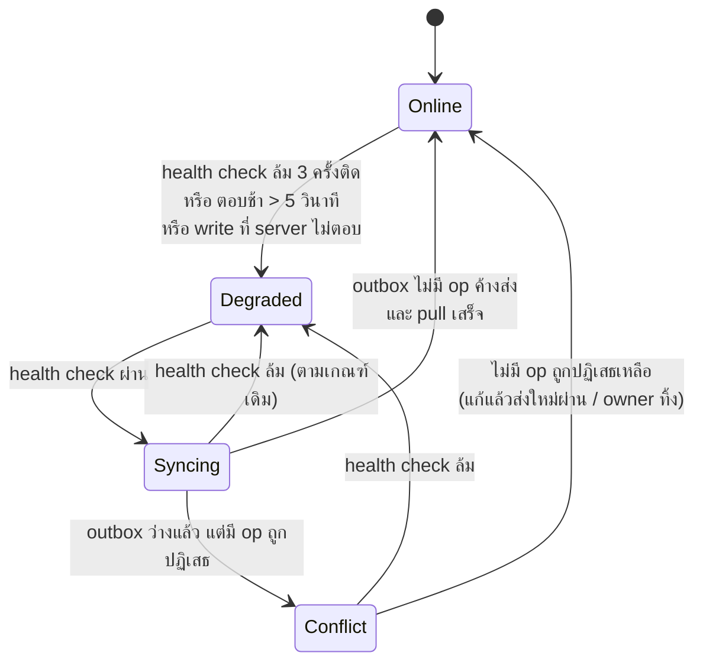

# 08 — Phase 2 spec: offline shell ถึง cutover

> เอกสารนี้เป็น**เจ้าของ**สเปกเฟส 2 (Architecture C degraded mode — `03_ARCHITECTURE.md §4`)
> ที่มา: การตัดสินใจของเจ้าของโปรเจกต์ **D1–D15** ใน #240 (2026-09-15) · แผนที่งาน #243
> 🔴 **อัปเดตเดียวกันวัน (เจ้าของโปรเจกต์ 2026-09-15): D15 เคาะแล้ว** — production = VM ของภาค `mob04` (ในมหาวิทยาลัย)
> สภาพแวดล้อมเดียว ไม่มี demo แยก · เป้าเฟส 2 = รันในมหาวิทยาลัยพร้อมส่งอาจารย์ · **cutover ร้านจริงจากนอกมหาวิทยาลัย = เฟสถัดไป ไม่อยู่ใน spec นี้**
> ADR ที่แก้ตามเอกสารนี้: [0004](adr/0004-device-roles.md) · [0007](adr/0007-receipt-numbering.md) ·
> [0009](adr/0009-jwt-session-lifetime.md) · [0010](adr/0010-client-write-through-cache.md) (addendum 2026-09-15 ในแต่ละไฟล์)
> **เอกสารนี้ขัดกับ ADR เมื่อไร ยึด ADR** — ถ้าเจอจุดขัด ให้แก้ ADR ก่อน ไม่ใช่เดาจากไฟล์นี้
>
> 🔴 **ห้ามแต่งข้อความไทยใหม่** (`02_API_SCREENS.md §8.1`) — ทุกข้อความที่หน้าจอต้องใช้แต่ยังไม่มีคำ อยู่ใน §15 ข้อ Q13
> 🔴 **เจ้าของโปรเจกต์ขอให้เลือกทางที่ง่ายกว่าเสมอ** — ถ้ามีสองทางที่ปลอดภัยเท่ากัน เอกสารนี้เลือกทางที่มีชิ้นส่วนน้อยกว่า

สถานะ 2026-09-15: **ร่างแรก** — ยังไม่มีโค้ด · ข้อที่ยังต้องให้เจ้าของตอบอยู่ §15 · slice อยู่ §13 · จุดขัด §16

---

## 0. สรุปหน้าเดียว

| เรื่อง | เฟส 2 ทำแบบนี้ | มาจาก |
|---|---|---|
| บทบาทคน | `owner` + `staff` เท่านั้น (`manager` หาย, `cashier` → `staff`) — **slice แรก** | D12 |
| เปิดแอปตอนไม่มีเน็ต | PWA + service worker เขียนเอง เสิร์ฟจาก nginx ของเรา | D2, #241 |
| แท็บ | เครื่อง `pos` เปิดได้แท็บเดียว (Web Locks) | D10 |
| เข้าโหมด Degraded | health check ล้ม 3 ครั้ง / ช้า > 5 วินาที **หรือ** write ที่ server ไม่ตอบ | D5 |
| ออกจาก Degraded | **health check เท่านั้น** | D5 |
| ขายตอนออฟไลน์ | ขายได้ถ้าสต็อกในเครื่องพอ — **ไม่มี `offlineOk`** | D3 |
| เลขใบเสร็จ/ใบลดหนี้ | เครื่อง `pos` ออกเอง ทั้งออนไลน์และออฟไลน์ · PO/QT/CP server ออก | D4 |
| กะ | เปิดออฟไลน์ได้ · ปิดต้องออนไลน์ | D6 |
| void ออฟไลน์ | staff ทำได้ ต้องใส่เหตุผล → server ลงรายการให้ owner ตรวจ ไม่มีปุ่ม undo | D7 |
| catalogue ออฟไลน์ | ลูกค้า/ช่าง/ใบเสนอราคา = เข้าคิว · สินค้า/หมวด/PO/ล้างใบเสนอราคาเก่า = ออนไลน์เท่านั้น | D9 |
| PIN ออฟไลน์ | ทุกคนตั้งได้ · ออฟไลน์ทุกคนมีสิทธิ์แค่ staff · owner ต้องตั้งไม่ซ้ำ PIN ออนไลน์ · อายุ 3 วัน | D11, D13 |
| เน็ตกลับหลังเข้าด้วย PIN ออฟไลน์ | ขายต่อได้ · outbox ส่งด้วย device token · แถบขอให้ล็อกอินจริงก่อน write ออนไลน์ถัดไป | D8 |
| ทิ้ง op ที่ถูกปฏิเสธ | owner เท่านั้น ออนไลน์ + PIN ที่ server ตรวจ + หมายเหตุบังคับ + `audit_log` · ใครก็แก้แล้วส่งใหม่ได้ | D14 |
| production host | **VM ของภาค `mob04`** (4 vCPU / 6 GB / 48 GB, ในมหาวิทยาลัย) — สภาพแวดล้อมเดียว และเป็น production · #242 ปิดด้วยข้อนี้ | D15 (เคาะ 2026-09-15) |

---

## 1. ขอบเขต

**อยู่ในเฟส 2:** offline shell (PWA + Drift + outbox), `POST /sync/push`, การออกเลข RC/CN ที่เครื่อง `pos`,
PIN ออฟไลน์, void ออฟไลน์ + รายการให้ owner ตรวจ, หน้าจอ reconciliation, **ความพร้อมของ production ในมหาวิทยาลัย** (`mob04`, §14)

**ไม่อยู่ในเฟส 2** (#243 *Out of scope*): หลายเครื่อง `pos` ต่อร้าน (ADR-0004 คงหนึ่งเครื่อง) · `change_log` / CRDT
(ตีตกใน #191) · CouchDB (ADR-0012) · ใบกำกับภาษีเต็มรูป ·
**cutover ร้านจริงจากนอกมหาวิทยาลัย (#231) และ host บน cloud** — เฟสถัดไป (ผลเทียบ cloud อยู่ branch `research/production-host`)

**ข้อเท็จจริงที่ spec นี้ยืนอยู่:** ร้านมีเครื่อง `pos` **เครื่องเดียว** (index `one_pos_per_tenant`) และเครื่องนี้เป็นผู้เดียวที่ตัดสต็อก
ผ่านการขาย ขยับยอดหนี้ช่าง และถือลิ้นชัก — ข้อมูลในเครื่องจึงถูกต้องตอนออฟไลน์ ยกเว้นสิ่งที่เครื่อง `backoffice` แก้ระหว่างนั้น
(ลดสต็อก ลบสินค้า แก้วงเงิน) ซึ่งไปจบที่การปฏิเสธตอน push → reconciliation (§10)

---

## 2. บทบาทคน — `owner` + `staff` (D12)

### 2.1 การตัดสินใจ

* `users.role` เหลือ `'owner' | 'staff'` — migration แก้ CHECK `('owner','manager','cashier')`
  (`server/src/db/migrations/1788652800000-InitialSchema.ts:57`)
* `cashier` → `staff` · `manager` หาย · อำนาจของ manager ที่ D12 ระบุ (**void, override วงเงินเครดิต, discard**) → `owner`
* ทำเป็น **slice แรกของเฟส 2** เพราะ guard ทุกตัวที่ตามมาอ้างชื่อ role

### 2.2 ขนาดงานที่ตรวจจากโค้ดจริง (2026-09-15, `main` @ `8e873cd`)

**server** — ที่อ้างชื่อ role เป็นสตริง:

| ที่ | ตอนนี้ | อยู่ในรายการของ D12 ไหม |
|---|---|---|
| `sales/void.service.ts:52` `ROLES_THAT_MAY_VOID = {'manager','owner'}` + PIN ของผู้ทำ | manager/owner | ✅ void → `owner` |
| `sales/sales.service.ts:396` `overrideCreditLimit` | **ไม่มี role gate เลย** — ใครก็ส่ง flag ได้ (มี `audit_log`) | ✅ แต่เป็น**ข้อจำกัดใหม่** ไม่ใช่การย้าย (ดู §16 ข้อ X3) |
| `requireManager()` ใน `products.controller.ts` (4), `catalogue.controllers.ts` (5 — categories/suppliers), `mechanics.controller.ts` (3 — create/update/delete), `purchase-orders.controller.ts` (4), `purchasing.controller.ts` (3), `settings.controller.ts` (1), `quotes.controller.ts` purge (1) | manager/owner | ❌ **D12 ไม่ได้พูดถึง** → §15 Q1 |
| `backup.controller.ts`, `devices.controller.ts` | owner เท่านั้น | ไม่เปลี่ยน |
| `platform-tenants.service.ts:78` สร้าง user แรกเป็น `'owner'` | owner | ไม่เปลี่ยน |

`server/test` มี ~41 ไฟล์ที่อ้าง `manager`/`cashier` (fixture + e2e) ต้องแก้ตาม

**client** — `frontend/lib` **ไม่มี** role gate ที่อ้างชื่อ role (`settings_screen.dart:341` แค่แสดง `user.role`) มีแค่ test 5 ไฟล์ที่ใช้สตริง
(`auth_cubit_test`, `auth_repository_test`, `doc_counter_seeding_test`, `login_redirect_test`, `token_storage_test`)

### 2.3 กติกา

* guard ใหม่มีสองแบบเท่านั้น: `requireOwner` และ "ผู้ใช้ที่ล็อกอินแล้ว" — ห้ามมีชุด role ซ้อนแบบ `{'manager','owner'}` อีก
* แถวของ `manager` ที่มีอยู่แล้วในฐานข้อมูลจะไปเป็นอะไร **ยังไม่เคาะ** (§15 Q2) — migration ต้องรอคำตอบ ห้ามเลือกเอง

---

## 3. PWA shell + แท็บเดียว (D2, D10)

ผลวิจัย: **#241 ตอบแล้ว** — `docs/research/pwa-offline-shell.md` บน branch `research/pwa-offline-shell` (ยังไม่ merge)

### 3.1 สิ่งที่ต้องมี

| # | อะไร | ทำไม |
|---|---|---|
| 1 | **service worker เขียนเอง** (Workbox) register จากสคริปต์ของเรา | Flutter 3.44 ไม่สร้าง service worker แล้ว — `flutter_service_worker.js` ที่ build ออกมาเป็นตัวที่ unregister ตัวเอง (flutter#156910) |
| 2 | precache: app shell (`index.html`, `flutter.js`, `flutter_bootstrap.js`, `main.dart.js`, `assets/`) + `sqlite3.wasm` + `drift_worker.js` + CanvasKit ในเครื่อง | ขาดตัวใดตัวหนึ่ง = เปิดแอปตอนเน็ตล่มไม่ขึ้น หรือขึ้นแต่ DB ไม่มา |
| 3 | build ด้วย `--no-web-resources-cdn` | ไม่งั้น CanvasKit ดึงจาก `gstatic.com` · 🔴 flag นี้เคยพังในบางรุ่น (flutter#148713) **ต้องพิสูจน์บน 3.44.3 ใน CI** |
| 4 | **bundle ฟอนต์ Sarabun/Barlow เป็น asset** | `google_fonts` ยิงเน็ตเองตอนรัน flag ข้อ 3 ไม่ครอบ (flutter#163554) — เป็น**เงื่อนไขก่อน** shell ไม่ใช่ของเสริม |
| 5 | ชื่อ cache ผูกกับ `github.sha` · ลบ cache เก่าตอน `activate` | image ใช้ tag `<sha>` อยู่แล้ว |
| 6 | **ถามก่อนโหลดรุ่นใหม่** — ห้าม `skipWaiting` อัตโนมัติ | ห้ามรีโหลดกลางบิล · ข้อความถามยังไม่มีคำ (§15 Q13) |
| 7 | `navigator.storage.persist()` ตอนบูต + บันทึกผล `persisted()` | กัน Chrome ไล่ลบ IndexedDB/OPFS แบบ LRU = counter + outbox หาย |
| 8 | nginx: `Cache-Control: no-cache` ที่ `/sw.js` | ให้เห็นรุ่นใหม่ในการโหลดครั้งถัดไป |
| 8b | 🔴 **cert ที่ browser เชื่อ** บนเครื่อง `pos` | service worker และ Web Locks ต้องการ secure context — `mob04` ใช้ cert self-signed จาก service `certgen` (`07_CICD_DEPLOY.md`) ซึ่ง Chrome **ไม่ยอม register service worker** ถ้า cert ไม่ถูกเชื่อ แม้จะกดข้ามหน้าเตือนแล้ว → ต้องติดตั้ง CA ของเราบนเครื่องที่ใช้ หรือหา cert ที่เชื่อได้ (ต้องพิสูจน์ใน slice `pwa.1`) |
| 9 | แก้ skew ของ asset web ก่อน (#245) | `pubspec.lock` = `sqlite3 3.4.0` / `drift 2.34.1` แต่ไฟล์ใน `web/` = 3.3.3 / 2.34.0 — precache ไฟล์ผิดรุ่นทำให้พังเงียบนานขึ้น |

### 3.2 แท็บเดียว (D10)

* ตอนบูต เครื่อง `pos` ขอ `navigator.locks.request('srisurart-pos-writer', {ifAvailable: true}, …)`
  * ได้ lock → เป็นแท็บเดียวที่มี `SyncService` และเขียน outbox ได้ · ถือ lock ไว้ตลอดอายุแท็บ
  * ไม่ได้ (`lock === null`) → แสดงหน้า "เปิดอยู่แล้วในแท็บอื่น" (ข้อความยังไม่มีคำ — §15 Q13) และ**ไม่เขียนอะไรเลย**
* แท็บปิด/crash → browser ปล่อย lock เอง ไม่ต้องมี heartbeat
* ใช้กับเครื่อง `pos` เท่านั้น — `backoffice` ออนไลน์เสมอ ไม่มี outbox
* Web Locks ต้องการ HTTPS (VM demo มี TLS แล้ว) · binding ใน `package:web` ต้องตรวจก่อนลงมือ (#241 ยังไม่ได้ยืนยัน)

---

## 4. State machine (D5)



### 4.1 นิยาม

| state | ความหมาย | write ใหม่ไปไหน |
|---|---|---|
| **Online** | server ตอบ · outbox ว่าง · ไม่มี op ถูกปฏิเสธ | ยิง endpoint ออนไลน์ตรง (ADR-0010) |
| **Degraded** | ถือว่าไม่มี server | op ที่เข้าคิวได้ (§5) → outbox · op ออนไลน์เท่านั้น → ปุ่มปิด |
| **Syncing** | server กลับมาแล้ว กำลังส่ง outbox แล้ว pull | **ต่อท้าย outbox** (รักษาลำดับ) · op ออนไลน์เท่านั้น → รอ |
| **Conflict** | ออนไลน์ + มี op ถูกปฏิเสธอย่างน้อยหนึ่ง | เหมือน Online · **แถบแดงค้างบนหน้าขาย** (#228) |

**Conflict ไม่ใช่โหมดที่หยุดขาย** — เป็น Online ที่มีแถบแดง เพราะเจ้าของเลือกแถบแดงค้าง (#228) ไม่ใช่ล็อกหน้าจอ
(03 §4 เดิมเขียน "Conflict → Online: ผู้จัดการเคลียร์" — ผู้จัดการไม่มีแล้ว D12 และ D14 ให้ใครก็แก้แล้วส่งใหม่ได้)

### 4.2 ตัวกระตุ้น (ค่าคงที่ทางเทคนิค — ไม่ใช่คำถามเจ้าของ ปรับได้ใน PR)

* health check = `GET /health/ready` ผ่าน nginx (แตะ DB + Redis) — **ไม่ใช้ `/health/live`** เพราะ live ตอบ 200 ตอน DB ล่ม
  ทำให้ออกจาก Degraded ทันทีทั้งที่ write ยังพัง (ขัด D5 "health check เป็นตัวตัดสินขาออก")
* ล้ม = ไม่ใช่ 200, หรือไม่ตอบใน 5 วินาที · **ล้ม 3 ครั้งติด** → Degraded · ผ่าน **1 ครั้ง** → Syncing
  (ส่ง outbox ซ้ำไม่อันตรายเพราะ idempotent จึงไม่ต้องรอผ่านหลายครั้ง)
* ระยะตรวจ: Online ทุก 15 วินาที · Degraded/Syncing/Conflict ทุก 5 วินาที
* "write ที่ server ไม่ตอบ" = ทุกอย่างที่ `isVerdict` ไม่นับ (timeout, socket หลุด, 5xx รวม 502/504 ของ nginx, 429,
  `503 IDEMPOTENCY_KEY_IN_FLIGHT`) — เกณฑ์เดียวกับ #183/#220 · write นั้น**เข้า outbox ด้วย id + key เดิม** แล้วเข้า Degraded
* 4xx คือคำตัดสิน **ไม่ใช่** สัญญาณเน็ตล่ม — ไม่ทำให้เข้า Degraded

### 4.3 กติกาลำดับ

* **ตราบใดที่ outbox มี op ค้างส่ง write ใหม่ทุกตัวต่อท้าย outbox** แม้ health check จะผ่าน — กันเคส void บิลที่ยังไม่ถึง server
  หรือช่างจ่ายเงินก่อนบิลเครดิตของตัวเองขึ้น
* op ที่ **ถูกปฏิเสธ ไม่ขวาง** op ถัดไป (#190) — op ที่พึ่งมัน (เช่นใบลดหนี้ของบิลที่ถูกปฏิเสธ) จะถูกปฏิเสธเองตามกติกาเดิมของ server

---

## 5. Op catalogue — อะไรเข้าคิว อะไรออนไลน์เท่านั้น (D3, D6, D7, D9)

### 5.1 เข้าคิวได้ (outbox)

| `type` | endpoint ออนไลน์ที่ใช้ service เดียวกัน | id ของแถวมาจาก | หมายเหตุ |
|---|---|---|---|
| `sale.create` | `POST /sales` | client (`sales.id` + `receiptNo` — §7) | D3: ตรวจสต็อกในเครื่องเท่านั้น ไม่มี `offlineOk` · วงเงินเครดิต §15 Q3 |
| `return.create` | `POST /returns` | client **ต้องเพิ่ม** — ตอนนี้ server ไม่รับ id (มีแต่ key) · `cnNo` จาก client (§7) | |
| `drawer.entry` | `POST /shifts/current/entries` | client **ต้องเพิ่ม** — ตอนนี้ `shifts.service.ts:370` `newId('de')` | |
| `shift.open` | `POST /shifts/open` | client **ต้องเพิ่ม** — ตอนนี้ `shifts.service.ts:186` `newId('sh')` | D6 · §15 Q6 |
| `sale.void_offline` | ไม่มีตัวออนไลน์ — ทางใหม่ใน `VoidService` ที่ไม่ตรวจ PIN | – | D7 · §8.3 |
| `credit_payment.create` | `POST /mechanics/:id/credit-payments` | client (มีแล้ว #24) | **ย้ายจาก `pending_credit_payments` มาอยู่ outbox เดียว** (§13 slice) ให้ลำดับกับบิลเครดิตถูก |
| `customer.create` / `customer.update` | `POST` / `PATCH /customers` | client **ต้องเพิ่ม** — ตอนนี้ `customers.service.ts:150` `newId('c')` | D9 · บิลในคิวอ้าง id ลูกค้าที่สร้างในคิวได้ |
| `mechanic.create` / `mechanic.update` | `POST` / `PATCH /mechanics` | client **ต้องเพิ่ม** — `mechanics.service.ts:165` | D9 · 🔴 ตอนนี้เป็น `requireManager` → ขัดกับ "ออฟไลน์ = สิทธิ์ staff" (§16 X2, §15 Q1) |
| `quote.create` / `update` / `delete` / `duplicate` | `/quotes*` | client **ต้องเพิ่ม** — `quotes.service.ts:193,301` | D9 · เลข QT server ออก (D4) → ใบในคิวยังไม่มีเลข §15 Q9 |

### 5.2 ออนไลน์เท่านั้น (ปุ่มปิดตอน Degraded/Syncing · ห้ามเขียน Drift ในเครื่อง)

`POST /shifts/close` (D6) · สินค้า add/update/delete/adjust-stock · หมวดหมู่ · ใบสั่งซื้อ save/receive/cancel/delete ·
`POST /quotes/purge` (D9) · void แบบ owner + PIN (§8.2) · discard op (D14) · ตั้ง PIN ออฟไลน์ (D13) · import backup ·
จัดการเครื่อง (#192) · export

**ยังไม่ได้จัดกลุ่ม** (D9 ไม่ได้พูดถึง — §15 Q10): พักบิล (`parked-sales`) · ซัพพลายเออร์ · settings · ลบลูกค้า/ช่าง · `quote.convert`

🔴 **กติกา #229:** ทุก write path ใน `frontend/lib/data/repositories/api_*.dart` ต้องเป็น **op ในคิว** หรือ **ปฏิเสธ** — fallback
`super.<write>()` ที่สร้างแถวอยู่ในเครื่องอย่างเดียวต้องหายหมด (`api_repository_contract_test.dart` ต้องจับได้)

### 5.3 outbox ในเครื่อง (Drift schema v7)

ตารางเดียว `outbox_ops`:
`opId` (PK) · `idempotencyKey` · `type` · `payload` (JSON ตรงตามที่จะส่ง) · `clientTime` · `userId` ·
`authMode` (`'online'` / `'offline_pin'`) · `status` (`'pending'` / `'rejected'`) · `rejectedCode` · `rejectedMessage` ·
`rejectedDetails` · `createdAt` · ลำดับ = `createdAt` แล้ว `opId`

* id + key สร้าง**ก่อน**ส่งครั้งแรก และเขียนลง Drift **ใน local transaction เดียวกับแถวที่ op นั้นสร้าง** (แพทเทิร์น `pending_credit_payments` #24)
* op ออกจาก outbox **เฉพาะเมื่อ server ตอบ `applied` แล้ว patch แถวในเครื่องสำเร็จ** (ADR-0010 ข้อ 3)
* **ไม่เพิ่มคอลัมน์ `sales.sync_status`** ที่ `01_DATABASE.md §11` / `03 §4` เคยเสนอ — สถานะของบิลอ่านจาก op ของมันใน outbox
  (มี `pending` = รอส่ง, มี `rejected` = ถูกปฏิเสธ, ไม่มี = ยืนยันแล้ว) ความจริงที่เดียว ไม่มีสองคอลัมน์ให้เพี้ยน

---

## 6. `POST /sync/push`

### 6.1 การยืนยันตัวตน (D8)

* ส่งด้วย **device token** ของเครื่อง (header `X-Device-Token`) — ไม่ต้องมี JWT ของคน
  server resolve token → `tid`, `did`, `drole` แบบเดียวกับ `/auth/token` (`auth_lookup_device_by_token`)
* `drole` ต้องเป็น `pos` · tenant ต้อง active (ADR-0003)
* 🔴 นี่คือ endpoint **เดียว** ที่รับ device token แทน access token — guard ของ `/api/*` อื่นยังรับเฉพาะ `typ=access` (ADR-0009)
* rate limit: ต่อ IP + ต่อ tenant ตาม ADR-0006 · log ต้อง redact `X-Device-Token`
* ข้อผิดพลาดระดับคำขอ (401/403/429/5xx/timeout) **ไม่เปลี่ยนสถานะ op ใดเลย** — เฉพาะผลต่อ op เท่านั้นที่เปลี่ยน

### 6.2 รูปคำขอ/คำตอบ (แทน `02_API_SCREENS.md §7`)

```jsonc
// POST /sync/push   (สูงสุด 50 op ต่อคำขอ — ที่เหลือส่งรอบถัดไป)
{ "ops": [
  { "opId": "op_9a3f", "idempotencyKey": "…", "type": "sale.create",
    "payload": { /* body เดียวกับ POST /sales รวม id + receiptNo */ },
    "clientTime": "2026-09-15T02:00:00Z",
    "userId": "u_12", "authMode": "offline_pin" }
] }

// 200
{ "status": "success", "data": { "results": [
  { "opId": "op_9a3f", "status": "applied",  "response": { /* คำตอบเดียวกับ endpoint ออนไลน์ */ } },
  { "opId": "op_9a40", "status": "rejected", "code": "INSUFFICIENT_STOCK", "message": "…", "details": { } },
  { "opId": "op_9a41", "status": "retry" }
] } }
```

| ผล | client ทำอะไร |
|---|---|
| `applied` | patch Drift จาก `response` ตามตาราง ADR-0010 ข้อ 3 แล้วลบ op |
| `rejected` | `status='rejected'` + เก็บ code/message/details · ไม่ส่งซ้ำเอง · รอคน (§10) |
| `retry` | เก็บไว้ `pending` ส่งรอบหน้า (เช่น `503 IDEMPOTENCY_KEY_IN_FLIGHT`, `CommitCeilingExceededError`, 5xx ภายใน op) |
| ไม่มีผลของ op นั้นในคำตอบ | ถือเป็น `retry` |

### 6.3 การประมวลผลฝั่ง server

1. ทำ **ทีละ op ตามลำดับใน array** · **แต่ละ op เป็น `runTx` ของตัวเอง ต่อกันทีละตัว** — ห้าม `Promise.all` (รูป deadlock #162)
   ห้ามรวมทั้ง batch เป็นทรานแซกชันเดียว (op หนึ่งถูกปฏิเสธต้องไม่ย้อน op อื่น — #190 และ commit ceiling 25 วินาทีของ #213 เป็นต่อทรานแซกชัน)
2. **เรียก service ตัวเดียวกับ controller ออนไลน์** (`SalesService.create`, `ReturnsService.create`, `ShiftsService.addEntry`/`open`,
   `CreditPaymentsService`, `CustomersService` …) — **ห้ามมี implementation ที่สอง** · lock order เดิมคงอยู่ทั้งหมด:
   บิล → (`shifts` `FOR SHARE`) → ช่าง → สินค้า (เรียง id) → `doc_counters` → ลูกค้า (CLAUDE.md, #22/#94/#100)
3. **idempotency ต่อ op:** `runIdempotent` ด้วย `idempotencyKey` ของ op และ 🔴 **fingerprint ต้องคำนวณเหมือน route ออนไลน์ทุกตัวอักษร**
   (method + path จริงของ endpoint ออนไลน์ เช่น `POST /api/v1/sales` + body) — เพราะบิลที่ยิงออนไลน์แล้ว timeout
   จะมาถึงอีกทีทาง push ด้วย key เดิม ถ้า fingerprint ต่างกัน replay จะกลายเป็น `IDEMPOTENCY_KEY_REUSED` แทนที่จะคืนบิลเดิม
   (บั๊กคลาสเดียวกับ `req.route.path` ของ void ใน PR #75)
4. op ที่ถูกปฏิเสธใน service → claim ย้อนไปพร้อมทรานแซกชัน (แพทเทิร์นเดียวกับ `CREDIT_LIMIT_EXCEEDED` → ส่งซ้ำด้วย key เดิม, #21)
   → client **แก้แล้วส่งใหม่ด้วย key เดิมได้** (§10.2)
5. `idempotency-routes.spec.ts` ต้องขยายให้ครอบ `/sync/push` (ทุก op type ต้องผ่าน claim ก่อน) — spec นี้ปักไว้ 38 route ห้ามแก้เพื่อให้เขียว

### 6.4 ตรวจซ้ำก่อนเข้า service

ทุก op:
* `userId` คือ **คำอ้างของเครื่อง** — server ตรวจไม่ได้ว่าใครกดจริง · บันทึกใน `audit_log` ในฐานะผู้ที่เครื่องอ้าง
* 🔴 **op ในคิวไม่มีอำนาจของ owner** — ถ้า payload ต้องใช้อำนาจ owner (ตอนนี้มีตัวเดียวคือ `overrideCreditLimit: true`, D12)
  ให้ `rejected` (code ใหม่ `OWNER_POWER_NOT_QUEUEABLE`) จนกว่า §15 Q3 จะเคาะ · op ที่เคย commit ไปแล้วตอนออนไลน์ replay ได้ตามปกติ
  (replay คืนผลที่เก็บไว้ ไม่ประเมินใหม่) — ข้อนี้เป็นข้อสรุปจาก D8+D12+D13 ต้องให้เจ้าของยืนยัน (Q3)
* เครื่องถูก retire → `rejected` `DEVICE_RETIRED` + `audit_log`

op ที่ `authMode = 'offline_pin'` (D13, #211) — เพิ่ม:
* user มีอยู่และ `is_active`
* role เป็น `owner` หรือ `staff` (ทั้งคู่ใช้ PIN ออฟไลน์ได้ — D13)
* **ล็อกอินออนไลน์สำเร็จครั้งล่าสุดของ user นี้บนเครื่องนี้ ≤ 3 วันก่อน `clientTime`** และ `clientTime` ไม่ก่อนการล็อกอินนั้น
  — อ่านจาก `audit_log` แถว `action='auth.login'` ที่มี `device_id` อยู่แล้ว (`auth.service.ts:200`) **ไม่เพิ่มตาราง**
  (ต้องมี index `(tenant_id, user_id, device_id, created_at) WHERE action='auth.login'`)
* ไม่ผ่าน → `rejected` `OFFLINE_PIN_REJECTED` + `audit_log` `sync.offline_pin_rejected` (บิลพิมพ์ไปแล้ว ห้ามทิ้งเงียบ)

### 6.5 ข้อจำกัดของการตรวจ

`clientTime` และ `userId` มาจากเครื่อง — คนที่ได้ storage ของเครื่อง `pos` ปลอมได้ทั้งคู่ ความปลอดภัยตั้งอยู่บน
(1) device token ถอนได้ด้วย `/retire` (2) op ในคิวทำได้แค่สิทธิ์ staff (3) void ออฟไลน์ทุกใบไปอยู่ในรายการให้ owner ตรวจ
— เท่ากับ threat model ที่ ADR-0009 ยอมรับไว้แล้วตอน #187

---

## 7. เลข RC/CN ออกที่เครื่อง `pos` (D4)

### 7.1 การตัดสินใจ

* เครื่อง `pos` ออก `RC` / `CN` เอง **ทั้งออนไลน์และออฟไลน์** จาก `DocCounters` ใน Drift (schema v6, #188)
* `PO` / `QT` / `CP` **server ออกตลอด** (ADR-0007 เดิม)
* รูปแบบไม่เปลี่ยน: `RC01-2569-09-0042`

### 7.2 server เมื่อไม่ออก RC/CN ให้ `pos` แล้ว

* `POST /sales` และ `POST /returns` (และ op ใน push) **ต้องมี** `receiptNo` / `cnNo` — ไม่มี → `400` (code ใหม่ `DOC_NUMBER_REQUIRED`)
  **ไม่ fallback ไปออกให้** เพราะสองคนออกเลขชุดเดียวกัน = hazard ของ #188 กลับมา
* ตรวจรูปแบบ: prefix ตรง doc type, `device_no` ตรงกับ `did` ของผู้เรียก, period อ่านได้และ **ไม่เกิน period ปัจจุบันของ tenant**
  (`TENANT_PERIOD_SQL` ตัวเดียวกับ issuer — ห้ามก๊อป), เลข 0001..9999
  ไม่ผ่าน → `400` `DOC_NUMBER_INVALID`
* ชน `UNIQUE (tenant_id, receipt_no)` / `cn_no`:
  * **ออนไลน์ตรง** → `409 RECEIPT_NO_CONFLICT` · ยังไม่พิมพ์ → client ขยับ counter แล้วส่งซ้ำด้วย **key เดิม** (claim ย้อนแล้ว)
  * **ทาง push** → `rejected` `RECEIPT_NO_CONFLICT` **ห้ามเปลี่ยนเลข** · ไม่มีอะไรของบิลนั้นถูกเขียน (#190, ADR-0007 ข้อ 3)
* บิลที่รับแล้ว → `UPDATE doc_counters SET last_no = GREATEST(last_no, n)` ใต้ row lock ตามลำดับเดิม (หลังสินค้า ก่อนลูกค้า)
  → `GET /doc-counters` ยังคืน high-water mark ที่ถูกต้องให้ seed
* ตัวออกเลขฝั่ง server (`doc-number.service.ts`) ยังอยู่ — ใช้ออก PO/QT/CP

### 7.3 hazard ของ seeded marker (#188) — ปิดยังไง

ต้นเหตุของ hazard คือ **server ยังออกเลขหลัง seed** — D4 ทำให้เครื่องเป็นผู้ออกคนเดียว marker ที่ได้หลังจุดสลับจึงเชื่อได้
**แต่ marker ที่เกิดก่อนจุดสลับเชื่อไม่ได้** ดังนั้น:

1. deploy server ก่อน (รับเลขจาก client) · client รุ่นเก่าจะได้ `400 DOC_NUMBER_REQUIRED` — ยอมรับได้เพราะก่อน cutover มีแต่ tenant สาธิต
2. client รุ่นที่ออกเลขเอง: migration schema v7 **ลบ `doc_counter_seeds` ทั้งหมด** → ต้อง seed ใหม่ซึ่งเกิดหลัง server หยุดออกแน่นอน
3. **ออกเลขได้เฉพาะเมื่อ period ปัจจุบันมี seed marker** (ADR-0007 ข้อ 2):
   * ออนไลน์ + ไม่มี marker → `GET /doc-counters` ก่อนบิลแรกของ period แล้วค่อยออก
   * ออฟไลน์ + ไม่มี marker → **ปฏิเสธก่อนเขียนหรือพิมพ์อะไร** (#189) · ข้อความไทย**ไม่ใช่** `OFFLINE_NOT_ALLOWED` เดิม (ข้อความนั้นพูดถึง `offlineOk` ซึ่งหายไปแล้ว — §15 Q13)
4. `max(local, server)` เท่านั้น ไม่ลดค่า · `9999` → error ชัด ห้ามวนกลับ `0001` (`DOC_NUMBER_EXHAUSTED`)
5. key ของ counter คือ `deviceId` (ไม่ใช่ `deviceNo`) ตาม #188 · re-issue เครื่องเดิม (#192) ต้อง seed ก่อนบิลแรก

⚠️ ข้อ 3 แปลว่า **ขึ้นเดือนใหม่ตอนเน็ตล่ม = ขายไม่ได้จนกว่าจะออนไลน์** — ทางเลี่ยงที่ยังเคารพข้อ 2 อยู่ใน §15 Q8

---

## 8. Void (D7, D12)

### 8.1 สองรูปแบบ

| | ออนไลน์ | ออฟไลน์ (Degraded) |
|---|---|---|
| ใคร | `owner` ที่ล็อกอินอยู่ + PIN ของตัวเอง (`VoidService.authorise` เดิม) | ใครก็ได้ที่เข้าระบบอยู่ (สิทธิ์ staff) |
| ต้องมี | PIN | **เหตุผล** (บังคับ ไม่ว่าง) |
| บิลต้องอยู่ | ในกะที่เปิดอยู่ของเครื่อง (#94) | ในกะที่เปิดอยู่ของเครื่อง (#94) — ตรวจในเครื่องก่อนเข้าคิว และ server ตรวจซ้ำ |
| เข้าคิว | ❌ — timeout = เหมือนเดิม (`PendingWrites` เก็บ id+key, PIN ต้องพิมพ์ใหม่ #154) | ✅ `sale.void_offline` |
| ผลหลังรับ | void ปกติ | void ปกติ **+ ลงรายการให้ owner ตรวจ** |
| undo | ไม่มี | **ไม่มี** (D7) |

### 8.2 server — void ออฟไลน์

* ทางใหม่ใน `VoidService` ที่**ใช้ core ของ void เดิม** (`voidIn`) แต่แทน `AuthorisedVoid` ด้วยหลักฐานว่าเป็น op จาก push ของเครื่อง `pos`
  — ห้ามเปิดทางนี้ให้ route ออนไลน์ใด ๆ (ไม่งั้นทุก staff void ได้โดยไม่มี PIN)
* ข้อตรวจเดิมทั้งหมดคงอยู่: `SALE_VOIDED` · `SALE_HAS_RETURNS` · `NO_OPEN_SHIFT` / `SALE_NOT_IN_OPEN_SHIFT` · lock order เดิม
* migration `sales`: `void_reason TEXT` · `void_mode TEXT CHECK (void_mode IN ('online_pin','offline_reason'))` ·
  `void_reviewed_at TIMESTAMPTZ` · `void_reviewed_by UUID` · index สำหรับ `void_mode='offline_reason' AND void_reviewed_at IS NULL`
* `audit_log` `sale.void.offline` (ผู้ที่เครื่องอ้าง, เหตุผล, ยอด)

### 8.3 รายการให้ owner ตรวจ

* `GET /sales/voids/review?status=pending` — owner, ออนไลน์
* `POST /sales/:id/void-review` — owner, idempotent, ตั้ง `void_reviewed_at/by` + `audit_log` · ตรวจแล้วถอนไม่ได้
* การตรวจ**ไม่เปลี่ยนเงินหรือสต็อก** — ถ้า owner เห็นว่า void ผิด ทางแก้คือขายใหม่ (ไม่มี undo, D7)
* หน้าจอแยกหรือรวมกับ reconciliation → §15 Q11

---

## 9. การยืนยันตัวตน (D8, D11, D12, D13)

### 9.1 PIN ออฟไลน์

| หัวข้อ | ค่า | ที่มา |
|---|---|---|
| ใครตั้งได้ | **ทุกคน** (`owner` และ `staff`) บนเครื่อง `role='pos'` | D13 |
| ตั้งเมื่อไหร่ | ตอน**ออนไลน์** ล็อกอินอยู่ บนเครื่องนั้น | ADR-0009 #187 (คงเดิม) |
| เก็บ | hash แบบช้าผูกเครื่อง (ความลับเฉพาะเครื่อง + salt สุ่มต่อ user) ใน Drift · **ไม่ส่งขึ้น server ไม่ว่ารูปไหน** | #187 (คงเดิม) |
| อายุ | ใช้ได้ **3 วัน** นับจากล็อกอินออนไลน์สำเร็จครั้งล่าสุดของ user นั้นบนเครื่องนี้ | D13 (#211 ที่เขียน 7 วันล้าสมัย) |
| ใช้ได้เมื่อ | **Degraded เท่านั้น** — ออนไลน์ต้องล็อกอินจริง | D13 |
| สิทธิ์ | **staff เท่านั้น** ไม่ว่าจริง ๆ จะเป็น role อะไร | D13 |
| ใส่ผิด | ล็อกในแอปหลังผิด 5 ครั้งติด (กันคนหน้าเคาน์เตอร์เท่านั้น) | #187 (คงเดิม) |
| ตรวจซ้ำ | ทุก op ใน push (§6.4) | D13 |
| owner | PIN ออฟไลน์**ต้องไม่ซ้ำ** PIN ออนไลน์ของตัวเอง (§9.2) · staff ไม่บังคับ | D11, D13 |

### 9.2 ตรวจว่า PIN ออฟไลน์ของ owner ไม่ซ้ำ PIN ออนไลน์ — โดยไม่ส่ง PIN ออฟไลน์ (หรือ hash ของมัน) ไปไหน

**ปัญหา:** D13 ให้ "ตรวจกับ server ตอนตั้ง" แต่ #187 ห้าม PIN ออฟไลน์ออกจากเครื่อง ทางตรง ๆ สองทางใช้ไม่ได้:
* ส่ง PIN ออฟไลน์ขึ้นไปให้ server เทียบ `pin_hash` → ฝ่า #187 และสร้าง **oracle เดา PIN** ("PIN นี้ใช่ PIN ออนไลน์ไหม") บน endpoint ใหม่
* ส่ง `pin_hash` ของ server ลงมาเทียบในเครื่อง → hash ของ PIN 4–6 หลักแกะได้ในเครื่อง = เหตุผลเดียวกับที่ #187 ห้าม cache `users.pin_hash`

**วิธีที่ใช้ — ให้ server ตรวจ "PIN ออนไลน์" แล้วเทียบความต่างในหน่วยความจำของเครื่อง:**

1. owner ล็อกอินออนไลน์ เปิดหน้า "ตั้ง PIN ออฟไลน์" บนเครื่อง `pos`
2. แอปขอ **PIN ออนไลน์ปัจจุบัน** ก่อน แล้วส่งไปที่ endpoint ใหม่ `POST /auth/verify-pin` (JWT ของ owner คนนั้น ตรวจได้เฉพาะ PIN ของตัวเอง)
   * server เทียบกับ `users.pin_hash` ด้วย argon2 · ใช้ `consumeAttempt` ถังเดียวกับ PIN ของ void (#154 — สูงสุด 5) ก่อน argon2 ·
     เขียน `auth.pin_ok` / `auth.pin_failed` (มีในรายการของ ADR-0009 แล้ว) · ตอบแค่ `204` หรือ `403`
   * endpoint นี้**ไม่เพิ่ม oracle ใหม่** — ทาง void ตรวจ PIN เดียวกันด้วย rate limit เดียวกันอยู่แล้ว
3. ผ่าน → แอปถือ PIN ออนไลน์ไว้**ในหน่วยความจำ**เท่านั้น แล้วให้ owner พิมพ์ PIN ออฟไลน์ใหม่ (สองครั้ง)
4. แอปเทียบ `PIN ออฟไลน์ != PIN ออนไลน์` **ในเครื่อง** — ซ้ำ → ปฏิเสธ (ข้อความยังไม่มีคำ §15 Q13)
5. ไม่ซ้ำ → hash PIN ออฟไลน์เก็บลง Drift · **ล้างตัวแปร PIN ทั้งสองทิ้งทันที** · ไม่มีอะไรลง log / storage

ผล: server เป็นผู้ยืนยันว่า "ตัวเลขที่เทียบคือ PIN ออนไลน์จริง" (ตามที่ D13 สั่ง) ส่วน PIN ออฟไลน์ไม่เคยออกจากเครื่อง

**ข้อจำกัดที่ต้องรู้:**
* ตรวจได้**ตอนตั้งเท่านั้น** — ถ้าภายหลัง owner เปลี่ยน PIN ออนไลน์ให้ตรงกับ PIN ออฟไลน์ ระบบรู้ไม่ได้
  (server ไม่มี hash ของ PIN ออฟไลน์ และเครื่องไม่รู้ PIN ออนไลน์ใหม่) — บอกในคู่มือ
* owner ที่ **ไม่มี `pin_hash`** (คอลัมน์ nullable) ไม่มีอะไรให้เทียบ → §15 Q5
* D13 พูดถึง "PIN ออนไลน์" ไม่ได้พูดถึง **รหัสผ่าน** — ถ้าต้องห้ามซ้ำรหัสผ่านด้วย ใช้วิธีเดียวกัน (owner พิมพ์รหัสผ่าน ตรวจกับ server แล้วเทียบในเครื่อง) → §15 Q5

### 9.3 หลังเน็ตกลับ ขณะเข้าด้วย PIN ออฟไลน์ (D8)

* **ขายต่อได้** · ไม่มีการแลกเป็น JWT เบื้องหลัง (ในเครื่องไม่มี credential ของคนให้แลก — ADR-0009)
* outbox ส่งด้วย **device token** (§6.1) · server ตรวจทุก op `offline_pin` (§6.4)
* แถบบนจอขอให้ล็อกอินออนไลน์ (ข้อความยังไม่มีคำ §15 Q13)
* **การตีความของ spec นี้** (ต้องให้เจ้าของยืนยัน §15 Q4): ตราบใดที่ session ยังเป็น `offline_pin` **write ทุกตัวที่เข้าคิวได้ยังเข้า outbox**
  แม้ state จะเป็น Online (ไม่มี JWT ให้ยิง endpoint ออนไลน์) · write ที่เป็นออนไลน์เท่านั้น (§5.2) ต้องล็อกอินจริงก่อน
  ("ก่อน write ออนไลน์ถัดไป" ใน D8)

### 9.4 ล็อกอินออนไลน์ปกติ

ไม่เปลี่ยน (ADR-0009): access 15 นาที, refresh หมดตี 4 ตาม `tenants.timezone`, RS256 · ทุกครั้งที่ล็อกอินออนไลน์สำเร็จบนเครื่อง `pos`
client บันทึกเวลาต่อ `(deviceId, userId)` ไว้ใช้คิด 3 วัน

---

## 10. Reconciliation + discard (D14, #230, #190)

### 10.1 สิ่งที่ผู้ใช้เห็น

* **แถบแดงค้างบนหน้าขาย** ตราบใดที่มี op `rejected` แสดงจำนวน (#228 — ข้อความยังไม่มีคำ §15 Q13)
* หน้า reconciliation: รายการ op ที่ถูกปฏิเสธทุกชนิด (รวมการชำระเครดิตที่เคยอยู่ banner ของหน้าช่าง #24) พร้อม code +
  ข้อความไทยของ server + payload เดิม + **เลขที่พิมพ์ไปแล้ว** (ถ้ามี)
* ปุ่มต่อ op: **แก้แล้วส่งใหม่** · **ทิ้ง** · **เปิดรายการที่เกี่ยวข้อง**

### 10.2 แก้แล้วส่งใหม่ — ใครก็ได้ (D14)

* ส่งใหม่ด้วย **`idempotencyKey` เดิม** (claim ของรอบที่ถูกปฏิเสธย้อนไปแล้ว — §6.3 ข้อ 4)
* 🔴 **ห้ามเปลี่ยน `receiptNo` / `cnNo` ของบิลที่พิมพ์แล้ว** (#190) — `RECEIPT_NO_CONFLICT` จึงแก้ด้วยการส่งใหม่ไม่ได้ ทางออกคือ discard
* ส่งใหม่ผ่าน `/sync/push` ถ้ายังอยู่ใน session `offline_pin` หรือไม่มี JWT · ผ่านรอบนี้ = ลบออกจากรายการ

### 10.3 ทิ้ง (discard) — owner เท่านั้น (D14)

* ต้อง **ออนไลน์** + owner ล็อกอินอยู่ + **PIN ที่ server ตรวจ** + **หมายเหตุบังคับ**
* endpoint ใหม่ `POST /sync/discards` `{opId, type, payload, rejectedCode, note, pin}` — header `Idempotency-Key` ใหม่
  * ตรวจ PIN **ก่อน** `runIdempotent` แบบเดียวกับ void (#154: short `runTx` อ่าน `pin_hash` แล้ว argon2 นอกทรานแซกชัน, `consumeAttempt`)
  * เขียน `audit_log` `sync.op.discarded` เก็บ payload เต็ม + code + หมายเหตุ **ใน transaction ของ endpoint เอง**
  * server **ไม่แตะเงิน/สต็อก** — op นั้นไม่เคยถูกเขียน
* client ลบ op **หลังได้ 2xx เท่านั้น** · ถ้าบิลที่ทิ้งเคยพิมพ์ใบเสร็จไปแล้ว เลขนั้นหายไปจากชุด → ปรากฏในรายงานเลขขาดช่วง (ADR-0007) พร้อม `audit_log` ที่อธิบาย
* 🔴 บิลที่ของออกจากร้านไปแล้วห้ามหายเงียบ — หมายเหตุบังคับคือหลักฐานเดียวในระบบ

---

## 11. กะออฟไลน์ (D6)

* **เปิดกะออฟไลน์ได้:** id ของกะสร้างที่เครื่อง (`newId('sh')`) · แถวกะในเครื่อง + op `shift.open` ใน local transaction เดียว
  · บิลในคิวทุกใบของกะนั้นพก `shiftId` นี้
* server: `POST /shifts/open` ต้องรับ `id` จาก client (ตอนนี้ server สร้างเอง) · ถ้ามีกะเปิดค้างอยู่ ระบบเดิม archive กะนั้นก่อนแล้ว — คงไว้
  · ⚠️ ถ้ากะ "วันนี้" ถูกปิดออนไลน์ไปแล้ว `open()` คืนแถวที่ปิดแล้ว (#100) — ดู §15 Q6
* `sale.create` / `return.create` / `drawer.entry` ในคิว: server ประทับกะที่เปิดอยู่ของเครื่องตามเดิม และ**ตรวจว่าตรงกับ `shiftId` ที่ op พกมา**
  ไม่ตรง → `rejected` (code ใหม่ `SHIFT_MISMATCH`) — ห้ามย้ายเงินไปลงกะอื่นเงียบ ๆ
* **ปิดกะต้องออนไลน์:** ใบปิดกะทางการคือ `GET /reports/closing?shiftId=` หลัง sync · client **ห้ามส่ง `POST /shifts/close` ขณะ outbox มี op `pending`**
  (ไม่งั้น op ที่มาถึงหลังปิดกะจะโดน `NO_OPEN_SHIFT`) · กรณีมี op `rejected` ของกะนั้นค้างอยู่ → §15 Q7
* เงินสดที่นับในเครื่องระหว่างออฟไลน์เป็นตัวเลขชั่วคราว — ตัวเลขทางการมาจาก server หลัง sync (#187 เดิม)

---

## 12. Reconnect: push แล้ว pull (#191 + D3)

* ลำดับ: **push outbox ก่อน แล้ว pull** (#191)
* pull = `GET /products?updatedSince=&afterId=` keyset เดิม · **ถอย cursor 30 วินาที** ทุกครั้ง · รับ tombstone (`deleted_at IS NOT NULL`) ·
  ไม่มี `change_log` · ไม่มี `GET /sync/pull` / `GET /sync/bootstrap` แบบ `serverSeq` ของ `02 §7` เดิม
* สินค้าที่ยังมี op ค้างใน outbox (`pending` หรือ `rejected`) **ไม่ถูกเขียนทับสต็อก**จนกว่า op จะหมด · ตัวอื่นเขียนทับด้วยค่าของ server
* **ไม่มี `offlineOk`** — ไม่คำนวณ ไม่อ่านจาก pull (D3 แทน #191 ข้อนั้น และ AC ของ #212)
* 30 วินาทีปลอดภัยเพราะ commit ceiling 25 วินาที (#213) · ช่องค้าง: import ประทับ `updated_at` (#217 — merge แล้วใน PR #224)

---

## 13. ลำดับ slice ที่ควรมี (ticket)

ลำดับพึ่งพา ไม่ใช่วันที่ · "NEW:" = ยังไม่มี ticket · ticket ที่มีอยู่ต้องแก้ AC ตามเอกสารนี้ก่อนลงมือ (อีก agent ทำ)

| # | slice | ticket | บล็อกโดย | แก้ AC ตาม |
|---|---|---|---|---|
| 0a | แก้ skew asset web (`sqlite3.wasm` / `drift_worker.js`) | **#245** | – | – |
| 0b | bundle ฟอนต์ Sarabun/Barlow เป็น asset | **NEW: `fe.fonts`** | – | §3.1 ข้อ 4 |
| 1 | **ยุบ role เป็น `owner` + `staff`** (migration CHECK, guard ทุกตัว, auth, test ~41 ไฟล์) | **NEW: `role.1`** | §15 Q1, Q2 | §2 |
| 2 | PWA shell + service worker + `persist()` + แท็บเดียว (Web Locks) + nginx `sw.js` | **NEW: `pwa.1`** (ผลวิจัย #241) | 0a, 0b | §3 |
| 3 | เครื่อง `pos` ออก RC/CN (server รับ/ตรวจ/`GREATEST`, ปฏิเสธถ้าไม่มีเลข, client ลบ seed marker ใน schema v7) | **NEW: `num.1`** | – | §7.1–7.3 |
| 4 | ปฏิเสธออกเลขออฟไลน์เมื่อ period ยังไม่ seed | **#189** | 3, §15 Q8 | §7.3 ข้อ 3 (ข้อความไม่ใช่ `OFFLINE_NOT_ALLOWED`) |
| 5 | outbox (Drift v7 `outbox_ops`) + `SyncService` + state machine D5 + `POST /sync/push` สำหรับ sale/return/drawer | **#228** | 1, 3 | §4, §5.3, §6 · client id ของ return/drawer entry |
| 6 | ย้ายการชำระเครดิตจาก `pending_credit_payments` เข้า outbox เดียว | **NEW: `q2.cp`** | 5 | §5.1 |
| 7 | กะออฟไลน์: `shift.open` ในคิว, client shift id, `SHIFT_MISMATCH`, ห้ามปิดกะขณะมี op ค้าง | **NEW: `q2.shift`** | 5, §15 Q6/Q7 | §11 |
| 8 | PIN ออฟไลน์ (ทุกคน, สิทธิ์ staff, 3 วัน) + `POST /auth/verify-pin` + ตรวจ owner ไม่ซ้ำ + ตรวจซ้ำใน push | **#211** | 1, 5, §15 Q5 | §9.1–9.3, §6.4 (#211 ยังเขียน 7 วัน + cashier only) |
| 9 | void ออฟไลน์ + เหตุผล + รายการให้ owner ตรวจ | **NEW: `q2.void`** | 1, 5, 7 | §8 |
| 10 | catalogue: ลูกค้า/ช่าง/ใบเสนอราคาเข้าคิว (client id) · สินค้า/หมวด/PO/purge ออนไลน์เท่านั้น · ลบ fallback ในเครื่อง | **#229** | 1, 5, §15 Q1/Q9/Q10 | §5.1–5.2 |
| 11 | push แล้ว pull, ถอย 30 วินาที, tombstone, ไม่มี `offlineOk` | **#212** | 5 | §12 (#212 ยังเขียน 5 วินาที + `offlineOk`) |
| 12 | วงเงินเครดิตตอนออฟไลน์ | **#194** | 1, 5, **§15 Q3** | premise "เครื่องอื่นขยับยอดได้" ไม่จริงแล้ว |
| 13 | `RECEIPT_NO_CONFLICT` ใน push → reconciliation เลขไม่เปลี่ยน | **#190** | 3, 5 | §7.2 |
| 14 | แถบแดง + หน้า reconciliation + resend + `POST /sync/discards` (owner+PIN+หมายเหตุ) | **#230** | 5, 13, §15 Q11/Q13 | §10 (#230 ยังเขียน manager PIN) |
| 15 | แถบ Degraded/Syncing/Conflict + คู่มือร้าน (**ตัดป้ายเทา**) | **#195** | 2, 5, §15 Q13 | D3 |
| 16 | ทดสอบทั้งสอง code path ใน CI | **#193** | 5–11 | ตัด "offline refuses non-`offlineOk`" ออกจาก AC |
| 17 | ออกโค้ดใหม่ให้เครื่องเดิม + หน้าจัดการเครื่อง | **#192** | 3 (ต้อง seed ก่อนบิลแรก) | – |
| 18 | ~~เลือก production host~~ | ~~#242~~ — **ปิดแล้ว (D15 = `mob04`)** | – | – |
| 19 | production ในมหาวิทยาลัย: deploy ขึ้น `mob04` + วัด RAM 6 GB | **#184** | – | §14 |
| 20 | `pg_dump` รายวันส่งออกนอก VM + ซ้อม restore (รวมค่า role-in-database ของ `pos_app`) | **NEW: `ops.backup`** | 19 | §14 |
| 21 | ทาง deploy ถึง VM ในมหาวิทยาลัย | **#67** | **§15 Q14** | §14 |
| – | ~~cutover ร้านจริง~~ | **#231 — เฟสถัดไป** ไม่อยู่ใน spec นี้ | – | – |

---

## 14. ความพร้อมของ production ในมหาวิทยาลัย (D15)

> เดิมหัวข้อนี้คือ "ข้อกำหนดก่อน cutover (#231)" — เจ้าของโปรเจกต์ตัดสิน 2026-09-15 ว่า **production = `mob04` สภาพแวดล้อมเดียว**
> และ cutover ร้านจริงจากนอกมหาวิทยาลัยเป็นเฟสถัดไป · #231 จึงไม่อยู่ใน spec นี้

**เป้า:** ระบบเฟส 2 รันบน `mob04` (4 vCPU / 6 GB / 48 GB, ในเครือข่ายมหาวิทยาลัย) พร้อมส่งอาจารย์ · ร้านจริงยังใช้ Drift build ต่อ

* slice 0a–17 เสร็จ และ #193 เขียวทั้งสอง code path
* **deploy ขึ้น `mob04`** ด้วย `deploy.yml` ของ Ansible + rollback ที่พิสูจน์แล้ว (#184) · `/health/ready` เขียว · `.current_sha` ถูก
* **วัดว่า 6 GB พอไหม** — สแตกเต็ม (nginx + api×3 + Postgres + Redis×2 + worker + Bull-Board + etcd + monitoring) ภายใต้ k6 ของ `02 §9`
  บันทึก RSS ต่อ container · ถ้าไม่พอ ต้องบอกเจ้าของก่อนตัดอะไรออก (#184)
* **backup:** `pg_dump` รายวัน **ส่งออกนอก VM** (ไฟล์ที่อยู่บน VM เดียวกันไม่ใช่ backup) + **ซ้อม restore อย่างน้อยหนึ่งครั้ง**
  🔴 restore ต้องคืนค่า role-in-database ของ `pos_app` (`statement_timeout=25s`, `idle_in_transaction_session_timeout=5s`, #213) —
  `pg_dump` ธรรมดา**ไม่พาค่านี้ไป** (ต้อง `pg_dumpall --roles-only` หรือรัน migration `1788652802131` ซ้ำ) · ตรวจด้วย warning ของ `DbModule` ตอนบูต
* ทาง deploy ถึง VM ที่อยู่ในมหาวิทยาลัย — ยังไม่เคาะ (#67, §15 Q14)
* PWA ติดตั้งบนเครื่องที่ใช้สาธิตแล้ว `navigator.storage.persisted()` เป็น `true` และ cert ถูกเชื่อ (§3.1 ข้อ 8b)
* เครื่อง `pos` seed counter หลังจุดสลับ D4 (§7.3) ก่อนบิลแรก
* ข้อความไทยทุกตัวใน §15 Q13 มีคำที่เจ้าของเลือกแล้ว

---

## 15. คำถามที่ต้องให้เจ้าของตอบ (Open questions — owner)

ห้าม agent ตอบเอง · ทุกข้อบอกว่าบล็อก slice ไหน

| # | คำถาม | ทางเลือกที่เห็น (ไม่ได้เลือกให้) | บล็อก |
|---|---|---|---|
| **Q1** | D12 ย้าย void / override วงเงิน / discard ไป `owner` — **อำนาจ manager อื่นที่โค้ดมีอยู่** (สินค้า/หมวด/ซัพพลายเออร์ CRUD, ปรับสต็อก, สร้าง/แก้/ลบช่าง, ใบสั่งซื้อทั้งหมด, แก้ settings, ล้างใบเสนอราคาเก่า, export CSV — §2.2) ไป `owner` หรือ `staff`? | (ก) ทั้งหมด → owner (staff แก้สินค้า/รับของไม่ได้) · (ข) ทั้งหมด → staff · (ค) แยกรายตัว | 1, 10 |
| **Q2** | user ที่เป็น `manager` อยู่แล้ว migrate เป็นอะไร และ **ร้านหนึ่งมี `owner` ได้กี่คน** | owner / staff / ให้ platform admin เลือกต่อคน · owner 1 คน / หลายคน | 1 |
| **Q3** | ขายเครดิตเกินวงเงิน: **ออนไลน์** staff ทำได้ไหม (D12 ทำให้ override เป็นของ owner แต่วันนี้ใครก็ override ได้) · **ออฟไลน์** (สิทธิ์ staff, #194) ทำยังไง · และยืนยันกติกา §6.4 "op ในคิวไม่มีอำนาจ owner" | ออฟไลน์: (ก) ปฏิเสธในเครื่อง · (ข) เข้าคิวโดยไม่มี override → server ปฏิเสธ → reconciliation · (ค) ยอมให้ขาย แล้วลงรายการให้ owner ตรวจแบบ void ออฟไลน์ | 12 |
| **Q4** | ยืนยันการตีความ D8 (§9.3): session `offline_pin` หลังเน็ตกลับยัง**เข้าคิวทุก write** จนกว่าจะล็อกอินจริง | ใช่ / ไม่ (อธิบาย "ขายต่อได้" แบบอื่น) | 5, 8 |
| **Q5** | owner ที่ **ไม่มี PIN ออนไลน์** ตั้ง PIN ออฟไลน์ได้ไหม · ต้องห้ามซ้ำ **รหัสผ่าน** ด้วยไหม | ต้องตั้ง PIN ออนไลน์ก่อน / ได้โดยไม่ตรวจ · ห้ามซ้ำรหัสผ่านด้วย / เฉพาะ PIN | 8 |
| **Q6** | เปิดกะออฟไลน์ **หลังจากกะของวันนี้ถูกปิดออนไลน์ไปแล้ว** — server ตอนนี้คืนกะที่ปิดแล้ว (#100) บิลในคิวจะถูกปฏิเสธทั้งหมด | (ก) ห้ามเปิดกะใหม่ในวันเดียวกันในเครื่องด้วย · (ข) ให้วันหนึ่งมีหลายกะ (แก้ #100) | 7 |
| **Q7** | ปิดกะได้ไหมขณะมี op ของกะนั้น **ถูกปฏิเสธ** ค้างอยู่ | ต้องเคลียร์ก่อน / ปิดได้ ใบปิดกะไม่รวมรายการนั้น | 7 |
| **Q8** | ขึ้นเดือนใหม่ตอนเน็ตล่ม = ออกเลขไม่ได้ (ADR-0007 ข้อ 2) — ยอมรับ หรือให้ **seed เดือนถัดไปล่วงหน้า**ตอนออนไลน์ช่วงท้ายเดือน (ปลอดภัยเพราะเครื่อง `pos` เป็นผู้ออกคนเดียวหลัง D4) | ยอมรับ / seed ล่วงหน้า | 4 |
| **Q9** | ใบเสนอราคาที่สร้างตอนออฟไลน์ยังไม่มีเลข `QT` (server ออก, D4) — พิมพ์ A4 ได้ไหม | พิมพ์ได้แบบไม่มีเลข / ห้ามพิมพ์จนกว่า sync / ให้ `pos` ออก QT ด้วย (แก้ D4) | 10 |
| **Q10** | กลุ่มที่ D9 ไม่ได้พูดถึง: **พักบิล**, ซัพพลายเออร์, settings, ลบลูกค้า/ช่าง, แปลงใบเสนอราคาเป็นบิล | เข้าคิว / ออนไลน์เท่านั้น / (พักบิล) เก็บในเครื่องอย่างเดียว | 10 |
| **Q11** | รายการ void ให้ owner ตรวจ: หน้าจอแยก หรือรวมในหน้า reconciliation (#243) | แยก / รวม | 9, 14 |
| **Q12** | คอลัมน์ `Products.offlineOk` ใน Drift (schema v3) — ลบ หรือปล่อยไว้ไม่ใช้ (#243) | ลบใน schema v7 / ปล่อยไว้ | 5 |
| **Q13** | **ข้อความไทยที่ยังไม่มี** (ห้ามแต่ง): แถบแดง · แถบ Degraded · สถานะ Syncing · "เปิดอยู่แล้วในแท็บอื่น" · ถามโหลดรุ่นใหม่ (#241 ร่างไว้ `รุ่นใหม่พร้อมแล้ว — โหลดใหม่?` = ร่างของ agent ยังไม่มีใครเลือก) · ช่องเหตุผล void ออฟไลน์ (และเป็นข้อความอิสระหรือตัวเลือก) · ปุ่มส่งใหม่/ทิ้ง · หน้าจอ PIN ออฟไลน์ + PIN ซ้ำ · แถบขอให้ล็อกอินจริง · ปุ่มออนไลน์เท่านั้นที่ถูกปิด · ปฏิเสธออกเลขเพราะยังไม่ seed · code ใหม่ `DOC_NUMBER_REQUIRED`, `DOC_NUMBER_INVALID`, `OFFLINE_PIN_REJECTED`, `OWNER_POWER_NOT_QUEUEABLE`, `SHIFT_MISMATCH`, `DEVICE_RETIRED` | – | 2, 4, 8, 9, 14, 15 |
| **Q14** | deploy ขึ้น VM ที่อยู่ในเครือข่ายมหาวิทยาลัยยังไง — GitHub-hosted runner เข้าไม่ถึง `mob04` (#67, `handoff_log/session-2026-09-15-phase1-closeout.md §6`) | (ก) self-hosted runner บน VM (ออกขาเดียว จำกัดเฉพาะ job `deploy`) · (ข) รัน Ansible ด้วยมือต่อไป · (ค) Tailscale — (ก)/(ค) ต้องมี addendum ADR-0013 | 21 |

---

## 16. จุดที่การตัดสินใจขัดกันเอง หรือขัดกับโค้ด

| # | จุดขัด | ผล |
|---|---|---|
| X1 | **D12** ระบุอำนาจ manager แค่ 3 อย่าง แต่โค้ดมี `requireManager` อีก ~20 route (§2.2) | → Q1 · slice 1 เริ่มไม่ได้ |
| X2 | **D9** ให้ช่างเข้าคิวออฟไลน์ แต่ **D13** ออฟไลน์ = staff และ `mechanics.controller.ts` create/update เป็น `requireManager` → ถ้า Q1 ตอบ (ก) op ช่างในคิวจะถูกปฏิเสธทุกใบ | → Q1 |
| X3 | **D12** บอกว่า override วงเงิน "ย้าย" ไป owner แต่ server **ไม่เคยจำกัด role** ของ `overrideCreditLimit` — เป็นข้อจำกัดใหม่ต่อการขายที่ร้านทำทุกวัน (`02 §8.2`) และทำให้ #194 (ออฟไลน์ = staff) ไม่มีทาง override | → Q3 |
| X4 | **D7** vs **D12**: ออนไลน์ staff void ไม่ได้ (ต้อง owner + PIN) แต่ออฟไลน์ staff void ได้ด้วยเหตุผลอย่างเดียว — ดึงสายแลนออกแล้วได้อำนาจเพิ่ม · รายการให้ owner ตรวจเป็นตัวถ่วงเดียว | บันทึกไว้ ไม่ต้องเคาะใหม่ (D7 ชัดเจน) |
| X5 | **D13** ให้ owner cache PIN ออฟไลน์ ขัดกับ ADR-0009 #187 "ห้ามแคช credential ของ owner/manager เด็ดขาด" | D13 ชนะ (ใหม่กว่า) · เหตุผลเดิมยังจริงบางส่วน → กันด้วยสิทธิ์ staff + ห้ามซ้ำ PIN ออนไลน์ · แก้ ADR-0009 แล้ว |
| X6 | **D8** "ขายต่อได้" กับ "ล็อกอินจริงก่อน write ออนไลน์ถัดไป" อ่านได้สองแบบ | → Q4 |
| X7 | **D8** push ด้วย device token ขัดกับ ADR-0009 "guard ของ `/api/*` รับเฉพาะ `typ=access`" และแถว `/sync/push` ใน `02 §4.2` (คอลัมน์ต้องล็อกอิน ✔) | ข้อยกเว้นเฉพาะ `/sync/push` บันทึกใน ADR-0009 addendum |
| X8 | **D6** เปิดกะออฟไลน์ vs `ShiftsService.open` ที่ server สร้าง id เองและคืนกะที่ปิดแล้วของวันนี้ (#100) | → Q6 · server ต้องรับ client id |
| X9 | **D4** vs โค้ด: server สร้าง id ของลูกค้า/ช่าง/ใบเสนอราคา/กะ/รายการลิ้นชักเอง และ `POST /returns` ไม่รับ id — op ในคิวที่อ้างกันต้องใช้ id จาก client | งานใน slice 5/7/10 |
| X10 | **D9** ให้ใบเสนอราคาเข้าคิว แต่ **D4** ให้ server ออก `QT` | → Q9 |
| X11 | **D3** ตัด `offlineOk` แต่ `OFFLINE_NOT_ALLOWED` (`02 §8.1`) ถูกใช้ทั้งกับ `offlineOk` และกับ "period ยังไม่ seed" ใน ADR-0007 ข้อ 2 / #189 | ข้อความเดิมใช้ไม่ได้ → Q13 |
| X12 | `02 §6` แถว job `sync.apply` (BullMQ) ขัดกับ #228 ที่ต้องคืนผลต่อ op ในคำขอเดียวกันผ่าน service เดียวกัน | push เป็น synchronous — แถวนั้นถูกแทน |
| X13 | `02 §7` (`/sync/pull?since=serverSeq`, `/sync/bootstrap`, `change_log`) ยังไม่ถูกขีดทิ้งหลัง #191 ตีตก `change_log` | ขีดทิ้งแล้วในรอบนี้ |
| X14 | `03 §4` "Conflict → Online: ผู้จัดการเคลียร์" — ไม่มีผู้จัดการแล้ว (D12) และ D14 ให้ใครก็ส่งใหม่ได้ | §4.1 |
| X15 | ticket ที่ล้าสมัย: #211 (7 วัน, cashier), #212 (5 วินาที, `offlineOk` จาก pull), #195 (ป้ายเทา), #193 AC (non-`offlineOk`), #194 (premise หลายเครื่อง), #230 (manager PIN), #189 (`OFFLINE_NOT_ALLOWED`) | แก้ ticket ตาม §13 (อีก agent) |
| X16 | `01_DATABASE.md §11` / `03 §4` เสนอ `sales.sync_status` | ไม่ทำ — สถานะอยู่ใน outbox ที่เดียว (§5.3) |
| X17 | **D15** ให้ `mob04` เป็น production สภาพแวดล้อมเดียว แต่ ADR-0013 / `07_CICD_DEPLOY.md` ตั้งชื่อ environment ว่า `demo` และ `03 §8` เขียนว่า VM คณะ "สาธิตเท่านั้น" | ADR-0013 / 07 ต้องมี addendum เรื่องชื่อและความหมายของ environment — ไม่อยู่ในรอบนี้ (ไม่ใช่ ADR 4 ฉบับที่ spec นี้แก้) |
| X18 | **D2** (service worker) ต้องการ cert ที่ browser เชื่อ แต่ `mob04` ใช้ self-signed | §3.1 ข้อ 8b |

---

## 17. สิ่งที่เอกสารนี้แทนที่ (Superseded)

| เดิม | ที่อยู่ | แทนด้วย |
|---|---|---|
| scarcity rule `offlineOk = stock ≥ max(5, 3×เฉลี่ย)` และ "ออฟไลน์ขายได้เฉพาะ `offlineOk`" | `03 §4`, `00_INDEX` ข้อค้าง 2, `adr/README` ค้างเดิม | D3 — ขายได้ถ้าสต็อกในเครื่องพอ |
| `offlineOk` คำนวณในเครื่อง (#191) | ADR-0004 addendum #191 ข้อ 3 | D3 |
| ป้ายเทา "เน็ตล่มขายไม่ได้" | `03 §4`, #195 | D3 |
| เข้า Degraded ด้วย health check อย่างเดียว; "Degraded → Syncing: เน็ตกลับมา" ไม่ระบุตัวตัดสิน | `03 §4` state diagram | D5 (§4) |
| PIN ออฟไลน์เฉพาะ `cashier`, ห้ามแคช credential owner/manager, สิทธิ์ = ขาย `offlineOk` | ADR-0009 #187 | D13 |
| ยังไม่เคาะ: PIN ออฟไลน์ต้องห้ามซ้ำไหม · re-login vs แลก JWT · void ออฟไลน์ | ADR-0009 *ยังไม่เคาะ* | D11/D13 · D8 · D7 |
| void = manager (+owner) + PIN | `void.service.ts`, `02 §4.2` แถว `/sales/:id/void` | D12 (owner + PIN) + D7 (ออฟไลน์ staff + เหตุผล) |
| role `owner` / `manager` / `cashier` | `01 §5` DDL `users`, migration `InitialSchema` | D12 |
| การอ่านว่าเฟส 2 เครื่อง `pos` ออก RC/CN **เฉพาะตอนออฟไลน์** ส่วนออนไลน์ server ยังออก | #188 hazard, #189 | D4 — ออนไลน์ด้วย (§7) |
| discard ต้องใช้ manager PIN | #230 | D14 |
| `sync.apply` BullMQ job · `/sync/pull` + `/sync/bootstrap` + `serverSeq` + `change_log` | `02 §6`, `02 §7` | §6 (synchronous) · §12 (keyset pull #191) |
| `sales.sync_status` | `01 §11`, `03 §4` | §5.3 |
| "Conflict → Online: ผู้จัดการเคลียร์" | `03 §4` | §4.1 |
| outbox แยกของการชำระเครดิต (`pending_credit_payments`) | #24, ADR-0010 | outbox เดียว (§5.1, slice 6) |
| "ต้องเลือก production host ก่อน `q4`" · VM คณะ = สาธิตเท่านั้น · cutover ร้านจริงเป็นเป้าเฟส 2 | `03 §8`, `00_INDEX` ข้อค้าง 7, #231 | D15 — `mob04` คือ production สภาพแวดล้อมเดียว · cutover ร้านจริง = เฟสถัดไป |

---

**ก่อนหน้า:** [`07_CICD_DEPLOY.md`](07_CICD_DEPLOY.md) · **ADR:** [`adr/README.md`](adr/README.md)
