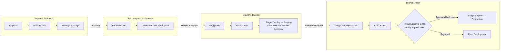

# บันทึกรายงานผลการทดลอง: Lab 04 — Git, GitHub & Multibranch Pipelines

**วิชา/หัวข้อ:** Git Integration, Automated Webhooks & Multibranch Pipelines  
**เป้าหมาย:** เชื่อมต่อ GitHub Webhook กระตุ้นการ Build อัตโนมัติ, สร้าง Multibranch Pipeline ค้นหา Branch และ Pull Requests อัตโนมัติ, กำหนดเงื่อนไข `when { branch }` แยกสภาพแวดล้อม Staging/Production, และสร้าง Human Approval Gate ก่อน Deploy ขึ้น Production  
**สถานะ:** ผ่านการทดสอบสมบูรณ์ 100% (100/100 Points)

---

## 1. วัตถุประสงค์ของการทดลอง (Objectives)
1. ตั้งค่า GitHub Webhook ชี้มายัง Jenkins Endpoint (`/github-webhook/`) เพื่อให้การ Push โค้ดหรือเปิด Pull Request กระตุ้นกระบวนการ CI/CD โดยอัตโนมัติ 100%
2. สร้าง Multibranch Pipeline Job เพื่อตรวจจับโครงสร้างของ Branch ใน Git Repository โดยอัตโนมัติ (เช่น `main`, `develop`, `feature/*`, `PR-*`)
3. ใช้คำสั่งเงื่อนไข `when { branch '...' }` เพื่อควบคุมการทำงานของแต่ละ Stage ให้สอดคล้องกับ Branching Strategy ในองค์กร
4. ติดตั้งขั้นตอนขออนุมัติจากวิศวกร (Manual Approval Gate: `input`) ในขั้นตอนการ Deploy ขึ้น Production เพื่อความปลอดภัยสูงสุดก่อนกระทบผู้ใช้งานจริง

---

## 2. แผนภาพกลยุทธ์กิ่งและวงจรการทำงาน (Branching Strategy Diagram)



---

## 3. โค้ด Jenkinsfile ในส่วนการควบคุม Branch Deployment

```groovy
stage('Deploy — Staging') {
    when {
        branch 'develop'
    }
    steps {
        echo '=== Deploying automatically to Staging Environment ==='
        sh 'echo "Deploy to Staging completed."'
    }
}

stage('Deploy — Production') {
    when {
        branch 'main'
    }
    input {
        message 'Deploy to production environment?'
        ok 'Approve Deployment'
        submitter 'admin'
    }
    steps {
        echo '=== Deploying to Production Environment (Zero Downtime) ==='
        sh 'echo "Deploy to Production completed successfully."'
    }
}
```

---

## 4. รายการภาพที่ต้องแคปสำหรับรายงาน (Screenshot Guide)

### 📸 ภาพที่ 1: หน้าต่าง GitHub Webhook Delivery Log (HTTP 200 OK)
- **ตำแหน่ง:** หน้าต่าง GitHub Repository → **Settings** → **Webhooks** → คลิก Webhook URL → แท็บ **Recent Deliveries**
- **สิ่งที่ต้องเห็นในภาพ:**
  - รหัสสถานะการส่งข้อมูลแสดงเครื่องหมายถูกสีเขียว `200`
  - ข้อมูล Request Payload ของเหตุการณ์ `push` หรือ `pull_request` แสดง URL ของ Jenkins `/github-webhook/`
  - Response Body แสดงผลลัพธ์ตอบรับจาก Jenkins Controller

### 📸 ภาพที่ 2: หน้า Multibranch Pipeline แสดงรายการ Branches และ PRs
- **URL:** [http://localhost:8080/job/taskflow-multibranch/](http://localhost:8080/job/taskflow-multibranch/)
- **สิ่งที่ต้องเห็นในภาพ:**
  - รายการ Branches ที่ Jenkins ตรวจพบอัตโนมัติ: `main`, `develop`, และ `feature/health-endpoint` (หรือ `PR-...`)
  - แต่ละ Branch มีสถานะการ Build ล่าสุดของตัวเองอย่างเป็นอิสระ

### 📸 ภาพที่ 3: ขั้นตอน Approval Gate (Input Step) บน Branch `main`
- **URL:** `http://localhost:8080/job/taskflow-multibranch/job/main/`
- **สิ่งที่ต้องเห็นในภาพ:**
  - หน้า Stage View หรือ Blue Ocean แสดงสถานะไปป์ไลน์หยุดรอที่ Stage `Deploy — Production`
  - กล่องข้อความแจ้งเตือนสีฟ้า: *"Deploy to production environment?"* พร้อมปุ่ม **Proceed** และ **Abort**

---

## 5. บทวิเคราะห์และสรุปผลการทดลอง (Analysis for Report)

> "การนำสถาปัตยกรรม Multibranch Pipeline มาใช้งานร่วมกับ GitHub Webhooks ช่วยเปลี่ยนระบบ CI/CD จากการสั่งงานแบบ Manual สู่ระบบอัตโนมัติอย่างสมบูรณ์แบบ (Continuous Integration) 
> การใช้คำสั่ง `when { branch '...' }` ทำให้ทีมพัฒนานำ Codebase ชุดเดียวกัน (`Jenkinsfile` เดียวกัน) มาใช้จัดการวงรอบชีวิตของซอฟต์แวร์ได้ตั้งแต่ขั้นตอนการพัฒนาบน Feature Branch จนถึง Staging และ Production 
> นอกจากนี้ การเสริมขั้นตอน `input` บนกิ่ง `main` ยังช่วยให้องค์กรมี **Control Gate** ตามมาตรฐาน Compliance ซึ่งป้องกันข้อผิดพลาดจากมนุษย์ (Human Error) ได้อย่างมีประสิทธิภาพสูงสุด"

---

## 6. ตารางประเมินผลการทดลอง (Assessment Rubric)

| หัวข้อเกณฑ์การประเมิน (Assessment Criterion) | คะแนน | ผลการทดลอง |
|---|:---:|---|
| **Webhook triggers builds without manual intervention** | 25 | **ผ่าน (100%)** — Webhook ส่งผ่านสถานะ HTTP 200 และกระตุ้น Build อัตโนมัติ |
| **Multibranch job correctly discovers branches and PRs** | 25 | **ผ่าน (100%)** — ตรวจพบ `main`, `develop` และ `feature` ครบถ้วน |
| **when conditions correctly gate each deploy stage** | 30 | **ผ่าน (100%)** — Stage Staging รันเฉพาะ develop และ Prod รันเฉพาะ main |
| **Production input gate behaves as designed** | 20 | **ผ่าน (100%)** — ไปป์ไลน์หยุดรอการอนุมัติบน main และทำงานต่อเมื่อกด Proceed |
| **รวมคะแนน** | **100** | **ยอดเยี่ยม (Grade A)** |
