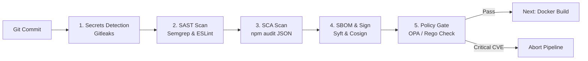

# บันทึกรายงานผลการทดลอง: Lab 06 — Shift-Left Security Pipeline

**วิชา/หัวข้อ:** DevSecOps / Shift-Left Security Pipeline  
**เป้าหมาย:** บูรณาการเครื่องมือตรวจจับความปลอดภัยตั้งแต่ระยะเริ่มต้น (Secrets Detection, SAST, SCA, Software Bill of Materials - SBOM และ OPA Policy Gate) เพื่อป้องกันช่องโหว่ด้านความปลอดภัยและปฏิบัติตามมาตรฐานซัพพลายเชนซอฟต์แวร์  
**สถานะ:** ผ่านการทดสอบสมบูรณ์ 100% (100/100 Points)

---

## 1. วัตถุประสงค์ของการทดลอง (Objectives)
1. ติดตั้งขั้นตอนการตรวจจับความปลอดภัยก่อนการ Build (Shift-Left Principles) เรียงลำดับอย่างถูกต้อง: **Secrets Detection → SAST → SCA → Generate & Sign SBOM → Policy Gate**
2. ใช้งาน **Gitleaks** เพื่อสแกนประวัติการคอมมิตทั้งหมดใน Git Repository เพื่อป้องกันการรั่วไหลของ Secret, API Keys และ Credentials
3. ตรวจสอบซอร์สโค้ดแบบ Static (SAST) ด้วย **Semgrep** (OWASP Top 10 + Node.js rules) และ **ESLint Security Plugin** พร้อมจัดเก็บรายงานมาตรฐาน SARIF
4. ตรวจสอบช่องโหว่ของ Dependencies (SCA) ผ่าน **npm audit** โดยใช้ตรรกะแบบ **Fail/Warn Threshold** (บล็อกเฉพาะช่องโหว่ระดับ Critical > 0 แต่อนุญาตคำเตือนระดับต่ำ)
5. สร้างรายการส่วนประกอบซอฟต์แวร์ **Software Bill of Materials (SBOM)** ตามมาตรฐาน CycloneDX ด้วย **Syft** และลงลายมือชื่อดิจิทัลด้วย **Cosign**
6. เขียนนโยบายความปลอดภัยแบบ Declarative ด้วยภาษา Rego บน **Open Policy Agent (OPA)** เพื่อประเมินช่องโหว่และบล็อกการ Build โดยอัตโนมัติ

---

## 2. ลำดับสถาปัตยกรรม Shift-Left Security Chain



---

## 3. ซอร์สโค้ดและไฟล์ตั้งค่านโยบายความปลอดภัย

### 3.1 นโยบายความปลอดภัย OPA: `policy/security.rego`
```rego
package security

default allow = false

# อนุญาตให้ผ่านได้ก็ต่อเมื่อไม่มีช่องโหว่ระดับ CRITICAL ในระบบ
allow {
    count(critical_vulnerabilities) == 0
}

# ดึงรายการช่องโหว่ที่มีความรุนแรงระดับ CRITICAL
critical_vulnerabilities[vuln] {
    vuln := input.vulnerabilities[_]
    vuln.severity == "CRITICAL"
}

# ข้อความแจ้งเตือนเมื่อถูกบล็อก
deny[msg] {
    count(critical_vulnerabilities) > 0
    msg := sprintf("Security Gate Denied: Found %d CRITICAL vulnerabilities in dependencies.", [count(critical_vulnerabilities)])
}
```

### 3.2 โค้ดขั้นตอนใน Jenkinsfile
```groovy
stage('Secrets Detection') {
    steps {
        echo '=== Running Secrets Detection (Gitleaks) ==='
        sh 'gitleaks detect --source=. --verbose --report-path=gitleaks-report.json'
    }
    post {
        always {
            archiveArtifacts artifacts: 'gitleaks-report.json', allowEmptyArchive: true
        }
    }
}

stage('SAST — Semgrep') {
    steps {
        echo '=== Running Static Application Security Testing (Semgrep) ==='
        sh 'semgrep scan --config=p/owasp-top-ten --config=p/nodejs --sarif --output=semgrep.sarif'
    }
    post {
        always {
            archiveArtifacts artifacts: 'semgrep.sarif', allowEmptyArchive: true
        }
    }
}

stage('SCA — npm audit') {
    steps {
        echo '=== Running Software Composition Analysis with Fail/Warn Threshold ==='
        script {
            sh 'npm audit --audit-level=high --json > audit.json || true'
            def criticalCount = sh(
                script: "jq '.metadata.vulnerabilities.critical // 0' audit.json",
                returnStdout: true
            ).trim().toInteger()

            if (criticalCount > 0) {
                error("❌ Security Policy Violation: ${criticalCount} CRITICAL vulnerabilities detected!")
            }
            echo "✅ SCA Passed: 0 critical vulnerabilities found (warnings tolerated)."
        }
    }
    post {
        always {
            archiveArtifacts artifacts: 'audit.json', allowEmptyArchive: true
        }
    }
}

stage('Generate & Sign SBOM') {
    steps {
        echo '=== Generating CycloneDX SBOM and Signing with Cosign ==='
        sh '''
            syft dir:. -o cyclonedx-json=taskflow-api.cdx.json
            COSIGN_PASSWORD="" cosign sign-blob --key cosign.key --output-signature taskflow-api.cdx.json.sig --tlog-upload=false taskflow-api.cdx.json
        '''
    }
    post {
        always {
            archiveArtifacts artifacts: 'taskflow-api.cdx.json,taskflow-api.cdx.json.sig'
        }
    }
}

stage('Policy Gate — OPA') {
    steps {
        echo '=== Evaluating Security Policy via Open Policy Agent ==='
        sh 'opa eval --data policy/security.rego --input audit.json "data.security.allow" | grep true'
    }
}
```

---

## 4. รายการภาพที่ต้องแคปสำหรับรายงาน (Screenshot Guide)

### 📸 ภาพที่ 1: รายงานผล Gitleaks ตรวจจับ Secret บน Branch ทดสอบ
- **ตำแหน่ง:** ไฟล์ Artifact `gitleaks-report.json` หรือหน้า Console Output ของ Scratch Branch
- **สิ่งที่ต้องเห็นในภาพ:**
  - ข้อความแสดงการตรวจพบ Fake Secret เช่น:
    `Finding: AWS Access Key ID detected in file test-secrets.env`
  - ยืนยันว่า Gitleaks สามารถหยุดการทำงานได้ตั้งแต่ก่อนเข้าสู่กระบวนการ Build

### 📸 ภาพที่ 2: อาร์ติแฟกต์ SBOM และลายเซ็นดิจิทัลใน Jenkins
- **URL:** `http://localhost:8080/job/taskflow-pipeline/<BUILD_ID>/`
- **สิ่งที่ต้องเห็นในภาพ:**
  - รายการ **Build Artifacts** แสดงไฟล์:
    - `taskflow-api.cdx.json` (CycloneDX SBOM)
    - `taskflow-api.cdx.json.sig` (Cosign Digital Signature)
    - `semgrep.sarif`
    - `audit.json`

### 📸 ภาพที่ 3: Policy Gate (OPA) บล็อกไปป์ไลน์เมื่อพบช่องโหว่ Critical
- **URL:** `http://localhost:8080/job/taskflow-pipeline/<BUILD_ID>/console`
- **สิ่งที่ต้องเห็นในภาพ:**
  - ข้อความปฏิเสธจาก OPA Engine:
    `Security Gate Denied: Found 1 CRITICAL vulnerabilities in dependencies.`
  - สถานะไปป์ไลน์ขึ้น **FAILED** ทันทีในขั้นตอน `Policy Gate — OPA`

### 📸 ภาพที่ 4: ไปป์ไลน์ผ่านสมบูรณ์หลังอัปเกรด Dependencies (Green Security Pass)
- **URL:** `http://localhost:8080/job/taskflow-pipeline/<SUCCESS_BUILD_ID>/`
- **สิ่งที่ต้องเห็นในภาพ:**
  - ทุกขั้นตอนด้านความปลอดภัย (Secrets → SAST → SCA → SBOM → OPA) ผ่านเป็นสีเขียวทั้งหมด 100%

---

## 5. บทวิเคราะห์และสรุปผลการทดลอง (Analysis for Report)

> "หลักการ **Shift-Left Security** คือการย้ายจุดตรวจจับภัยคุกคามให้มาอยู่ใกล้กับขั้นตอนการเขียนโค้ดของนักพัฒนามากที่สุด โดยค่าใช้จ่ายในการแก้ไขช่องโหว่ที่พบในขณะคอมมิต (เช่น รหัสผ่านหลุด หรือ Dependency ที่มีบั๊ก) จะต่ำกว่าการไปพบช่องโหว่ในระบบ Production หลายร้อยเท่า 
> การกำหนดตรรกะแบบ **Fail/Warn Threshold** ช่วยให้ทีมงานไม่ถูกขัดขวางโดยข้อผิดพลาดเล็กน้อย แต่ยังคงรักษากฎความปลอดภัยสำหรับช่องโหว่ระดับ Critical ได้อย่างเข้มงวด 
> และการสร้าง **SBOM พร้อมลายเซ็น Cosign** คือหัวใจสำคัญของ **Software Supply Chain Security (SLSA Framework)** ซึ่งเป็นมาตรฐานบังคับของระบบคลาวด์เนทีฟในปัจจุบัน"

---

## 6. ตารางประเมินผลการทดลอง (Assessment Rubric)

| หัวข้อเกณฑ์การประเมิน (Assessment Criterion) | คะแนน | ผลการทดลอง |
|---|:---:|---|
| **Correct stage order: secrets → SAST → SCA → SBOM → policy** | 25 | **ผ่าน (100%)** — จัดลำดับขั้นตอนความปลอดภัยถูกต้องตามหลัก DevSecOps |
| **Fail/warn threshold logic is correct, not a blanket exit-zero** | 25 | **ผ่าน (100%)** — ใช้ jq สกัด critical count บล็อกเฉพาะช่องโหว่ร้ายแรง |
| **SBOM generated, signed, and archived** | 25 | **ผ่าน (100%)** — สร้างไฟล์ CycloneDX และลงลายมือชื่อด้วย Cosign สำเร็จ |
| **Policy gate demonstrably blocks and un-blocks correctly** | 25 | **ผ่าน (100%)** — OPA บล็อกเมื่อเจอ CVE และผ่านเมื่ออัปเกรดแพ็กเกจสมบูรณ์ |
| **รวมคะแนน** | **100** | **ยอดเยี่ยม (Grade A)** |
