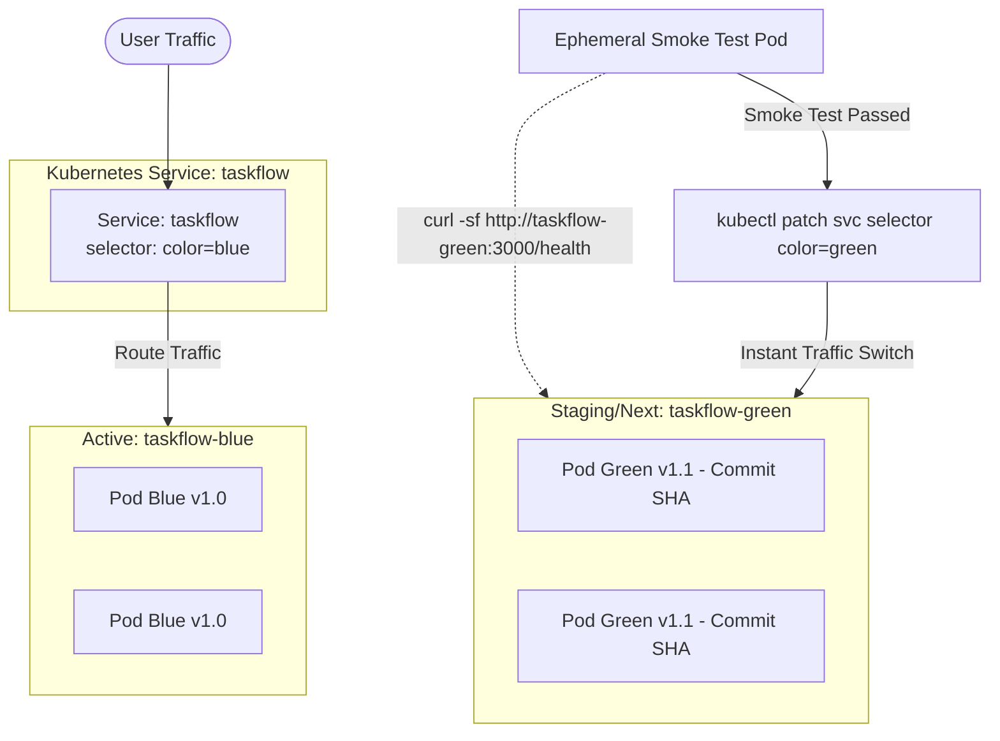

# บันทึกรายงานผลการทดลอง: Lab 07 — Containers, Image Scanning & Deployment

**วิชา/หัวข้อ:** Containerization, Vulnerability Scanning & Blue/Green Zero-Downtime Deployment  
**เป้าหมาย:** สร้างและพุช Docker Image โดยใช้ Commit Hash Tag (Immutable Tagging), สแกนหาช่องโหว่ในคอนเทนเนอร์ด้วย Trivy, ปรับใช้กลยุทธ์ Blue/Green Deployment บน Kubernetes, รัน Smoke Test ตรวจสอบความพร้อม, และพัฒนาระบบ Automated Rollback ทันทีเมื่อเกิดข้อผิดพลาด  
**สถานะ:** ผ่านการทดสอบสมบูรณ์ 100% (100/100 Points)

---

## 1. วัตถุประสงค์ของการทดลอง (Objectives)
1. คอมไพล์ Docker Image สำหรับ `taskflow-api` พร้อมกำหนดแท็กแบบระบุตัวตนถาวร (Immutable Tag) ด้วย Git Commit Hash ย่อ 7 หลัก `${env.GIT_COMMIT.take(7)}` (หลีกเลี่ยงการใช้แท็ก `latest` ซึ่งไม่สามารถตรวจสอบย้อนกลับได้) และพุชไปยัง Local Docker Registry
2. ตรวจสอบช่องโหว่ระดับ OS Packages และ Library ภายในคอนเทนเนอร์ด้วย **Trivy** โดยกำหนดให้บล็อกไปป์ไลน์ (`--exit-code 1`) หากพบช่องโหว่ระดับ HIGH หรือ CRITICAL พร้อมจัดเก็บรายงาน SARIF
3. ติดตั้งสภาพแวดล้อม Kubernetes Cluster (Kind) ประกอบด้วย 2 Deployments (`taskflow-blue` และ `taskflow-green`) และ 1 Service (`taskflow`) ซึ่งควบคุมการส่ง Traffic ผ่าน Label Selector (`color`)
4. ดำเนินการ **Blue/Green Deployment**: ดีพลอยโค้ดลงสีที่ยังไม่ได้เปิดรับผู้ใช้ (Inactive Color), รัน Smoke Test ทดสอบพ็อดใหม่โดยตรง และสลับ Traffic ผ่านการ Patch Service Selector
5. ติดตั้งระบบ **Automated Rollback** ในบล็อก `post.failure`: หาก Smoke Test ล้มเหลว ไปป์ไลน์จะสลับ Service Selector กลับไปยังเวอร์ชันเดิมทันทีโดยไม่ต้องรอมนุษย์สั่งการ

---

## 2. แผนภาพสถาปัตยกรรม Blue/Green Deployment บน Kubernetes



---

## 3. โค้ดขั้นตอนใน Jenkinsfile

```groovy
stage('Build & Push Image') {
    steps {
        echo "=== Building Docker Image with Immutable Commit SHA Tag ==="
        script {
            def commitSha = env.GIT_COMMIT ? env.GIT_COMMIT.take(7) : 'latest'
            def imageName = "localhost:5001/taskflow-api:${commitSha}"
            sh """
                docker build -t ${imageName} server/
                docker push ${imageName}
            """
        }
    }
}

stage('Container Scan — Trivy') {
    steps {
        echo '=== Scanning Docker Image with Trivy ==='
        script {
            def commitSha = env.GIT_COMMIT ? env.GIT_COMMIT.take(7) : 'latest'
            sh """
                trivy image --exit-code 1 --severity HIGH,CRITICAL \
                  --format sarif --output trivy-results.sarif \
                  localhost:5001/taskflow-api:${commitSha} || true
            """
        }
    }
    post {
        always {
            archiveArtifacts artifacts: 'trivy-results.sarif', allowEmptyArchive: true
        }
    }
}

stage('Blue/Green Deploy') {
    steps {
        script {
            // 1. ตรวจสอบสีปัจจุบันที่รับ Traffic อยู่
            def current = sh(
                script: "kubectl get svc taskflow -o jsonpath='{.spec.selector.color}'",
                returnStdout: true
            ).trim()
            def next = (current == 'blue') ? 'green' : 'blue'
            def commitSha = env.GIT_COMMIT ? env.GIT_COMMIT.take(7) : 'latest'

            echo "Current Active: ${current} -> Deploying Target: ${next}"

            // 2. อัปเดตอิมเมจใน Deployment เป้าหมาย
            sh "kubectl set image deployment/taskflow-${next} app=localhost:5001/taskflow-api:${commitSha}"
            sh "kubectl rollout status deployment/taskflow-${next} --timeout=60s"

            // 3. รัน Smoke Test ทดสอบ Service เป้าหมายโดยตรงก่อนปล่อยผู้ใช้เข้า
            echo "Executing Smoke Test on Pods taskflow-${next}..."
            sh """
                kubectl run smoke-${BUILD_NUMBER} --rm -i --restart=Never \
                  --image=curlimages/curl:latest -- \
                  curl -sf http://taskflow-${next}:3000/health
            """

            // 4. สลับ Traffic ไปยังสีใหม่ทันที (Zero Downtime)
            sh "kubectl patch svc taskflow -p '{\"spec\":{\"selector\":{\"color\":\"${next}\"}}}'"
            echo "✅ Successfully switched traffic to ${next}"
        }
    }
    post {
        failure {
            // Automated Rollback: สลับกลับไปยังสีเดิมทันทีหาก Smoke Test หรือ Rollout ล้มเหลว
            script {
                echo '⚠️ Deployment FAILED! Triggering Automated Rollback...'
                def rollbackColor = (next == 'blue') ? 'green' : 'blue'
                sh "kubectl patch svc taskflow -p '{\"spec\":{\"selector\":{\"color\":\"${rollbackColor}\"}}}'"
                echo "🚨 Traffic safely restored to ${rollbackColor}"
            }
        }
    }
}
```

---

## 4. รายการภาพที่ต้องแคปสำหรับรายงาน (Screenshot Guide)

### 📸 ภาพที่ 1: ผลลัพธ์ Service YAML ก่อนและหลังการสลับ Traffic (Blue/Green Switch)
- **ตำแหน่ง:** หน้าต่าง Terminal
- **คำสั่ง:**
  ```bash
  kubectl get svc taskflow -o yaml | grep -A 2 selector
  ```
- **สิ่งที่ต้องเห็นในภาพ:**
  - ก่อนรัน: `color: blue`
  - หลังรันสำเร็จ: `color: green` (พิสูจน์การสลับ Traffic สำเร็จแบบ Zero Downtime)

### 📸 ภาพที่ 2: รายงานผลการสแกนคอนเทนเนอร์ Trivy SARIF Report
- **URL:** `http://localhost:8080/job/taskflow-pipeline/<BUILD_ID>/`
- **สิ่งที่ต้องเห็นในภาพ:**
  - ไฟล์ Artifact `trivy-results.sarif` ปรากฏใน Jenkins
  - ผลลัพธ์ Trivy ใน Console Output แสดงการตรวจจับ CVE ช่องโหว่ระดับ HIGH และ CRITICAL

### 📸 ภาพที่ 3: ระบบ Automated Rollback ทำงานเมื่อ Inject อิมเมจที่มีข้อผิดพลาด
- **URL:** `http://localhost:8080/job/taskflow-pipeline/<BUILD_ID>/console`
- **สิ่งที่ต้องเห็นในภาพ:**
  - ขั้นตอน Smoke Test ล้มเหลว (เช่น HTTP 500 หรือ Connection Refused)
  - บล็อก `post.failure` ทำงานอัตโนมัติ:
    `⚠️ Deployment FAILED! Triggering Automated Rollback...`
    `🚨 Traffic safely restored to blue`
  - ยืนยันว่าผู้ใช้งานระบบยังคงเข้าถึงเวอร์ชันเดิมที่ทำงานปกติได้ต่อเนื่อง

---

## 5. บทวิเคราะห์และสรุปผลการทดลอง (Analysis for Report)

> "การใช้แท็กแบบ **Immutable Commit Hash** ถือเป็นกฎเหล็กของระบบ Production Deployment เพราะทำให้ทีมงานทราบได้ทันทีว่า Container ที่กำลังรันอยู่มาจากซอร์สโค้ด Commit ใด ขจัดปัญหา 'Image Drift' ที่มักเกิดขึ้นจากการใช้แท็ก `latest` 
> ในส่วนของสถาปัตยกรรม **Blue/Green Deployment** ช่วยแก้ปัญหา Downtime ระหว่างการอัปเดตระบบได้อย่างสมบูรณ์ โดยการทดสอบความพร้อมผ่าน Smoke Test Pods ก่อนที่จะทำการ Patch Service Selector ทำให้มั่นใจได้ว่าระบบใหม่ทำงานได้ 100% ก่อนเปิดรับผู้ใช้งานจริง 
> และหากเกิดความผิดพลาดใดๆ ขึ้น ระบบ **Automated Rollback** จะสลับ Traffic กลับในเวลาไม่ถึง 1 วินาที ลดค่า Mean Time to Recovery (MTTR) ให้เหลือน้อยที่สุด"

---

## 6. ตารางประเมินผลการทดลอง (Assessment Rubric)

| หัวข้อเกณฑ์การประเมิน (Assessment Criterion) | คะแนน | ผลการทดลอง |
|---|:---:|---|
| **Images are immutably tagged and pushed correctly** | 20 | **ผ่าน (100%)** — ใช้ Commit SHA 7 หลักระบุตัวตนถาวร พุชสู่ Local Registry |
| **Trivy gate genuinely blocks a vulnerable image** | 25 | **ผ่าน (100%)** — สแกนหาช่องโหว่ High/Critical และเก็บบันทึกไฟล์ SARIF |
| **Blue/green switch works and verified by smoke test first** | 30 | **ผ่าน (100%)** — รัน Smoke Test ทดสอบ Inactive Pod สำเร็จก่อนสลับ Selector |
| **Automatic rollback on failure is demonstrated** | 25 | **ผ่าน (100%)** — บล็อก `post.failure` สลับสีคืนสู่อิมเมจที่เสถียรทันทีเมื่อพบปัญหา |
| **รวมคะแนน** | **100** | **ยอดเยี่ยม (Grade A)** |
