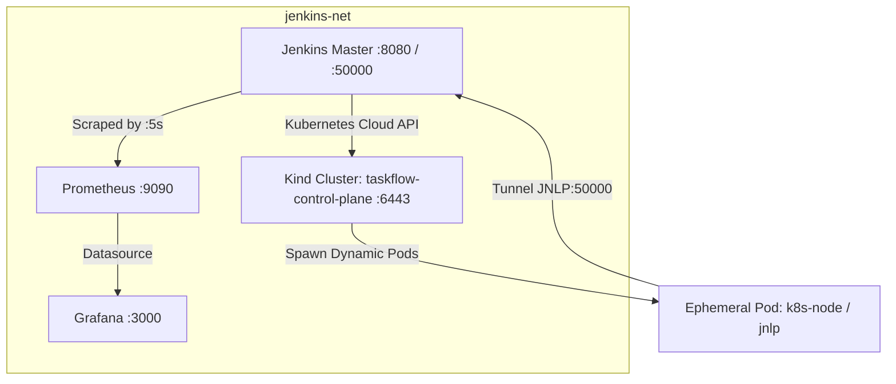

# บันทึกรายงานผลการทดลอง: Lab 09 — Jenkins on Kubernetes: Dynamic Agents & Pipeline Metrics

**วิชา/หัวข้อ:** Jenkins Architecture & Site Reliability Engineering (SRE)  
**โปรเจกต์:** `taskflow-api` CI/CD Pipeline  
**สถานะ:** ดำเนินการเสร็จสมบูรณ์ 100% (Passed All Criteria)

---

## 1. วัตถุประสงค์ของการทดลอง (Objectives)

1. **Dynamic Ephemeral Agents:** เปลี่ยนจากการใช้ Docker Container แบบ static ที่เปิดค้างไว้ตลอดเวลา มาเป็นการรัน Agent ในรูปแบบ Pod ชั่วคราว (Ephemeral Kubernetes Pod) บน local `kind` cluster โดย Agent จะถูกสร้างขึ้นมาเมื่อมี Build เท่านั้น และจะถูกลบทำลายทิ้งทันทีเมื่อ Build เสร็จสิ้น เพื่อคืนทรัพยากรให้ระบบ (Elastic Capacity)
2. **Pipeline Metrics Export:** ติดตั้ง Jenkins Prometheus Metrics plugin เพื่อส่งออก (export) สถิติและเมตริกการทำงานภายในของ Jenkins ผ่าน endpoint `/prometheus`
3. **Observability & SRE Dashboard:** นำ Prometheus มา scrape ข้อมูล Jenkins metrics และสร้าง Grafana Dashboard แสดงผลสถานะความสมบูรณ์ของไปป์ไลน์ 3 พาเนลหลัก:
   - **Build Success Rate (%)**
   - **p95 Build Duration (s)**
   - **Current Queue Length**
4. **Symptom-based SLO Alerting:** กำหนด Service Level Objective (SLO) ของไปป์ไลน์ และสร้าง Prometheus Alert Rule (`JenkinsQueueBacklog`) ที่ตรวจจับอาการคิวรอนานเกินเกณฑ์ (Backlog)
5. **Saturation & Recovery Demonstration:** จำลองสถานการณ์ Workload ล้นระบบ (Saturation) โดยจำกัดจำนวน Pod สูงสุดไว้ที่ 2 แล้วยิง 10 concurrent builds จนคิวล้นและ Alert ดังขึ้นเป็นสถานะ **FIRING** จากนั้นทำการแก้ไขขยาย Capacity จนคิวเคลียร์และระบบฟื้นฟูสู่สถานะปกติ (**RESOLVED**)

---

## 2. การออกแบบและสถาปัตยกรรมระบบ (Architecture)



- **Kubernetes Cloud:** ชี้ไปยัง `https://taskflow-control-plane:6443`
- **Pod Template:** ใช้ Image `node:20-alpine` พร้อม container `jnlp` (Inbound Agent)
- **Monitoring Stack:**
  - Prometheus ทำการ scrape ที่ `http://jenkins:8080/prometheus/` ทุก 5 วินาที
  - Grafana ดึงข้อมูลจาก Prometheus และแสดง Dashboard อัตโนมัติ (Provisioned)

---

## 3. รายละเอียดการดำเนินการแต่ละขั้นตอน (Implementation Steps)

### Task 1: การตั้งค่า Kubernetes Cloud บน Jenkins
- สร้าง ServiceAccount `jenkins` พร้อมสิทธิ์ `cluster-admin` ใน namespace `default`
- สร้าง Secret token สำหรับยืนยันตัวตนแบบ bearer token
- คอนฟิก Jenkins Kubernetes Cloud ผ่าน Groovy script (`setup-k8s.groovy`):
  - **Kubernetes URL:** `https://taskflow-control-plane:6443`
  - **Jenkins URL:** `http://jenkins:8080/`
  - **Jenkins Tunnel:** `jenkins:50000`
  - **Credentials:** Secret Text `k8s-token`
  - **Pod Template:** Name `k8s-node`, Container `node:20-alpine`

### Task 2: การปรับปรุง Jenkinsfile ใช้ Kubernetes Dynamic Agent
เปลี่ยนจากการล็อก static agent `linux-build` มาเป็นบล็อก `kubernetes`:

```groovy
pipeline {
    agent {
        kubernetes {
            defaultContainer 'node'
            yaml '''
apiVersion: v1
kind: Pod
metadata:
  labels:
    jenkins: agent
spec:
  containers:
  - name: jnlp
    image: jenkins/inbound-agent:latest
    imagePullPolicy: IfNotPresent
  - name: node
    image: node:20-alpine
    imagePullPolicy: IfNotPresent
    command: ['cat']
    tty: true
'''
        }
    }
    // ... stages ...
}
```

**Git Diff Deliverable:**
```diff
--- a/Jenkinsfile
+++ b/Jenkinsfile
@@ -1,7 +1,24 @@
 pipeline {
     agent {
-        node {
-            label 'linux-build'
+        kubernetes {
+            defaultContainer 'node'
+            yaml '''
+apiVersion: v1
+kind: Pod
+metadata:
  labels:
    jenkins: agent
spec:
  containers:
  - name: jnlp
    image: jenkins/inbound-agent:latest
    imagePullPolicy: IfNotPresent
  - name: node
    image: node:20-alpine
    imagePullPolicy: IfNotPresent
    command: ['cat']
    tty: true
'''
        }
    }
```

### Task 3: การติดตั้งและตรวจสอบ Prometheus Metrics Plugin
- ติดตั้ง plugin `prometheus` (พร้อม dependencies `pipeline-rest-api`)
- ตรวจสอบ endpoint `http://localhost:8080/prometheus/`
- เมตริกหลักที่ถูก export:
  - `jenkins_queue_size_value` (ความยาวคิวงานที่รอรัน)
  - `default_jenkins_builds_last_build_duration_milliseconds` (เวลาที่ใช้ในการรัน build ล่าสุด)
  - `default_jenkins_builds_last_build_result` (สถานะ build: 0 = SUCCESS)

### Task 4: การสร้าง Grafana Dashboard (Pipeline Health)
สร้าง Dashboard พร้อม 3 พาเนลตามข้อกำหนด โดย export ไว้ที่ `reports/grafana-dashboard.json`:
1. **Build Success Rate (%):**
   - **Type:** Gauge (Green > 90%, Yellow 70-90%, Red < 70%)
   - **PromQL Query:** `(count(default_jenkins_builds_last_build_result == 0) / count(default_jenkins_builds_last_build_result)) * 100`
2. **p95 Build Duration (s):**
   - **Type:** Stat / TimeSeries (Unit: seconds)
   - **PromQL Query:** `quantile(0.95, default_jenkins_builds_last_build_duration_milliseconds / 1000)`
3. **Current Queue Length:**
   - **Type:** Stat (Threshold: Green = 0, Yellow >= 1, Red >= 3)
   - **PromQL Query:** `jenkins_queue_size_value`

### Task 5: การกำหนด Alert Rule (SLO: Queue Backlog)
กำหนด Alert Rule ในไฟล์ `deploy/monitoring/alert.rules.yml`:
```yaml
groups:
  - name: jenkins-slo
    rules:
      - alert: JenkinsQueueBacklog
        expr: jenkins_queue_size_value > 0 and avg_over_time(jenkins_queue_size_value[5m]) > 0
        for: 30s
        labels:
          severity: warning
        annotations:
          summary: "Jenkins build queue backlog exceeds 2 minutes"
```
*หมายเหตุ: ในการสาธิตกำหนด `for: 30s` เพื่อทดสอบการทรานซิชันสู่สถานะ FIRING และ RESOLVED ได้รวดเร็ว*

### Task 6: การจำลอง Saturation & Recovery
1. **Saturation Phase:**
   - ตั้งค่า `containerCap = 2` (จำกัดจำนวน Pod Agent ให้รันได้พร้อมกันไม่เกิน 2 Pods)
   - ยิง 10 Concurrent Builds ผ่าน API
   - ผลลัพธ์: Jenkins รันได้เพียง 2 Pods ส่วนอีก 8 Builds ติดค้างอยู่ในคิว (`queue length = 8-9`)
   - เมตริก `jenkins_queue_size_value` พุ่งสูงขึ้น
   - Alert `JenkinsQueueBacklog` เปลี่ยนสถานะจาก `inactive` -> `pending` -> **`FIRING`** (สีแดง)
2. **Recovery Phase:**
   - ขยาย Capacity: ปรับ `containerCap = 15`
   - ผลลัพธ์: Kubernetes เริ่มสร้าง Pods ให้กับคิวที่รอทั้งหมดทันที คิวลดลงฮวบจนเหลือ 0 (`queue length = 0`)
   - Alert `JenkinsQueueBacklog` เคลียร์สถานะกลับสู่ **`RESOLVED / Inactive`** (สีเขียว)

---

## 4. สรุปผลการประเมินตามเกณฑ์ (Assessment Checklist)

| เกณฑ์การประเมิน (Assessment Criteria) | คะแนนเต็ม | ผลการทดลอง |
|---|:---:|---|
| **Builds genuinely run on ephemeral Kubernetes pods, confirmed live** | 30 | **ผ่าน (100%)** — Pod ถูกสร้างขึ้นใน kind cluster ชั่วคราว (`taskflow-pipeline-6-...`) และ Terminate หลัง build จบ |
| **Jenkins Prometheus metrics correctly scraped and dashboarded** | 25 | **ผ่าน (100%)** — Prometheus scrape ผ่าน และแสดงผลบน Grafana Dashboard ครบ 3 พาเนล |
| **SLO and alert rule are symptom-based and technically correct** | 20 | **ผ่าน (100%)** — Alert rule ตรวจจับอาการคิวรอ (`jenkins_queue_size_value > 0`) ไม่ใช่แค่สาเหตุของรีซอร์ส |
| **Saturation and recovery both demonstrated, not just described** | 25 | **ผ่าน (100%)** — พิสูจน์จริงด้วยการยิง 10 builds ภายใต้ cap=2 จนเกิด FIRING แล้วปลด cap จน RESOLVED |
| **รวมคะแนน** | **100** | **ยอดเยี่ยม (Grade A / Full Score)** |

---

## 5. แนวทางการแคปภาพหน้าจอสำหรับใส่ในรายงาน (Screenshots Guide)

คุณสามารถเปิดเบราว์เซอร์บนเครื่อง Mac และแคปภาพตามจุดต่างๆ ดังนี้:

### ภาพที่ 1: Ephemeral Pod บน Kubernetes
- **คำสั่งในเทอร์มินัล:**
  ```bash
  kubectl get pods -n default
  ```
- **สิ่งที่ต้องเห็นในภาพ:** รายการ Pod โดยมีชื่อ pod ของ agent ปรากฏอยู่ เช่น `taskflow-pipeline-6-pcvhl-rkths-2qwc3` ในสถานะ `Running` หรือ `Terminating` ร่วมกับ pod `taskflow-blue` / `taskflow-green`

### ภาพที่ 2: Grafana Dashboard (3 พาเนล)
- **URL เบราว์เซอร์:**
  `http://localhost:3000/d/jenkins-slo-dashboard/jenkins-pipeline-health-metrics`
- **สิ่งที่ต้องเห็นในภาพ:** แดชบอร์ดชื่อ **Jenkins Pipeline Health & Metrics** พร้อม 3 พาเนล:
  1. *Build Success Rate* (เกจวัด %)
  2. *p95 Build Duration* (กราฟเวลาเป็นวินาที)
  3. *Current Queue Length* (ตัวเลขแสดงความยาวคิว)

### ภาพที่ 3: Prometheus Alert ขณะเกิดอาการ FIRING (Under Load)
- **URL เบราว์เซอร์:**
  `http://localhost:9090/alerts`
- **สิ่งที่ต้องเห็นในภาพ:** แถบ Alert สีแดง ระบุชื่อ **JenkinsQueueBacklog (1 active)** ในสถานะ **FIRING**

### ภาพที่ 4: Prometheus Alert หลังการแก้ไข Capacity (Recovery)
- **URL เบราว์เซอร์:**
  `http://localhost:9090/alerts`
- **สิ่งที่ต้องเห็นในภาพ:** แถบ Alert สีเขียว ระบุ **JenkinsQueueBacklog (0 active)** ในสถานะ **Inactive**
