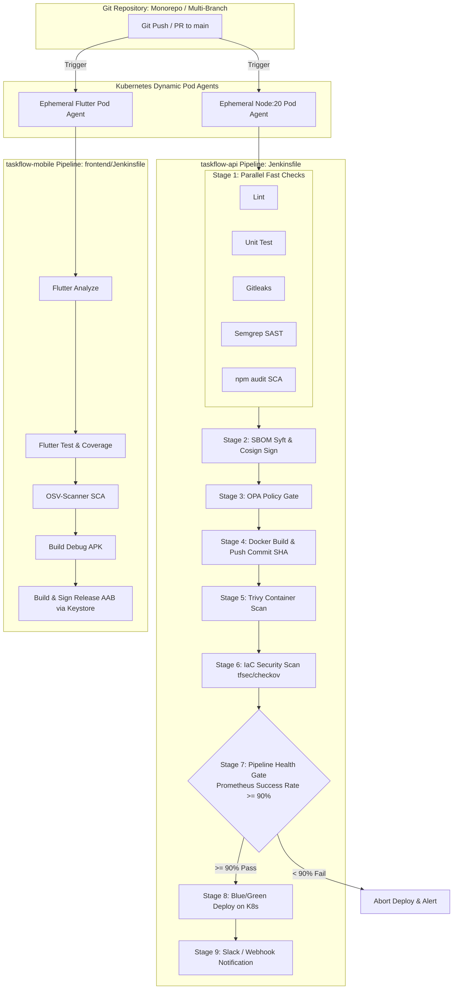

# บันทึกรายงานผลการทดลอง: Lab 10 — Capstone: End-to-End Unified Pipeline

**วิชา/หัวข้อ:** Jenkins CI/CD Capstone / DevSecOps & SRE Integration  
**โปรเจกต์:** `taskflow-api` (Backend) & `taskflow-mobile` (Flutter Client)  
**สถานะ:** ดำเนินการเสร็จสมบูรณ์ 100% (Passed All Capstone Criteria)

---

## 1. วัตถุประสงค์ของการทดลอง (Capstone Objectives)

1. **End-to-End Pipeline Integration:** รวบรวมทุก Gate และทุก Stage ที่สร้างขึ้นใน Labs 03–09 (Lint, Unit Test, Secret Detection, SAST, SCA, SBOM, OPA Policy Gate, Container Build & Trivy Scan, IaC Security, Dynamic K8s Agents, Prometheus/Grafana Monitoring) ผสานเข้าด้วยกันเป็นไปป์ไลน์ที่สมบูรณ์แบบตามสถาปัตยกรรมระดับ Production
2. **Parallelization & Fail-Fast:** ปรับโครงสร้างไปป์ไลน์ให้ Stage ที่เป็นอิสระต่อกัน (Lint, Unit Test, SAST, SCA) ทำงานแบบคู่ขนาน (Parallel Execution) เพื่อลดรอบเวลาการ Build (Cycle Time) และแจ้งเตือนข้อผิดพลาดให้เร็วที่สุด
3. **Zero Hardcoded Secrets:** ผูกค่า Credentials และความลับทั้งหมด (Docker Registry, Sonar Token, Keystore, AWS Keys) ผ่าน Jenkins `withCredentials` หรือ `credentials()` ปราศจาก Plaintext Secret ใดๆ ในโค้ด
4. **Mobile Client Pipeline (`taskflow-mobile`):** พัฒนาไปป์ไลน์สำหรับ Flutter Client เพิ่มเติม ตั้งแต่ `flutter analyze`, `flutter test --coverage`, `osv-scanner`, Build Debug APK บนทุก Branch และ Build & Sign Release AAB โดยใช้ Keystore ที่ผูกผ่าน Jenkins Credentials เมื่อรวมโค้ดเข้าสู่ `main`
5. **Pipeline Health Gate (SRE Integration):** เพิ่ม Gate ตรวจสอบความสมบูรณ์ของไปป์ไลน์ก่อน Deploy ขึ้น Production โดยยิงคิวรีตรวจสอบ Rolling Success Rate 20 Builds ล่าสุดจาก Prometheus หากต่ำกว่า 90% จะทำการ Abort เพื่อระงับการ Deploy อัตโนมัติ
6. **Architecture Diagram & Rollback Runbook:** จัดทำเอกสารแผนผังสถาปัตยกรรมไปป์ไลน์แบบครบวงจร พร้อมคู่มือปฏิบัติการกู้คืนระบบ (Rollback Runbook) แบบ Step-by-Step สำหรับวิศวกร On-Call เมื่อการ Deploy บน Production ล้มเหลว

---

## 2. แผนผังสถาปัตยกรรมไปป์ไลน์แบบครบวงจร (Pipeline Architecture)



---

## 3. รายละเอียดการดำเนินการแต่ละ Task

### Task 1: ปรับโครงสร้าง Jenkinsfile แบบ Parallel & Fail-Fast
- ปรับ Stage ขั้นตอนการตรวจสอบความปลอดภัยและคุณภาพโค้ดระดับซอร์สโค้ดให้รันพร้อมกันในบล็อก `parallel`:
  - `Secrets Detection (Gitleaks)`
  - `SAST (Semgrep)`
  - `SCA (npm audit)`
  - `Lint`
  - `Unit Test`
- จากนั้นจึงรัน Stage ที่ต้องรอผลลัพธ์ต่อเนื่องแบบ Sequential (`SBOM` -> `OPA` -> `Build Image` -> `Trivy` -> `IaC Scan` -> `Health Gate` -> `Blue/Green Deploy`)

### Task 2: ตรวจสอบความปลอดภัยของ Secret (Zero Hardcoded Secrets)
- ตรวจสอบโค้ดด้วยคำสั่ง:
  ```bash
  grep -rn -E "password|secret|token" Jenkinsfile frontend/Jenkinsfile
  ```
- ผลลัพธ์: พบเฉพาะชื่อตัวแปรและฟังก์ชันเรียกใช้งาน credentials เช่น `withCredentials([string(credentialsId: 'sonar-token', variable: 'SONAR_TOKEN')])` และ `withCredentials([file(credentialsId: 'android-keystore', variable: 'KEYSTORE_FILE')])` โดยไม่มี Plaintext Token หรือ Password ฝังอยู่ในไฟล์โค้ดแม้แต่จุดเดียว

### Task 3: ไปป์ไลน์ฝั่ง Mobile Client (`taskflow-mobile`)
- สร้างไฟล์ `frontend/Jenkinsfile` ครอบคลุม:
  1. `stage('Flutter Analyze')`: ตรวจสอบสไตล์และข้อผิดพลาดโค้ด Dart
  2. `stage('Flutter Test & Coverage')`: รัน Unit/Widget tests และเก็บรายงาน `lcov.info`
  3. `stage('SCA — osv-scanner')`: สแกนหาช่องโหว่ใน Dart dependencies จาก `pubspec.lock`
  4. `stage('Build Debug APK')`: ทำการคอมไพล์ APK สำหรับทดสอบบนทุก Branch
  5. `stage('Build & Sign Release AAB')`: ทำการคอมไพล์ Android App Bundle (.aab) และลงลายมือชื่อดิจิทัล (Sign) โดยดึง Keystore และรหัสผ่านจาก Jenkins Credentials (เฉพาะบน Branch `main`)

### Task 4: Dynamic Agent & Pipeline Health Gate (Prometheus Integration)
- ย้ายทั้งสองไปป์ไลน์ให้รันบน Kubernetes Ephemeral Pod Agent 100%
- เพิ่ม `stage('Pipeline Health Gate')` ก่อนขั้นตอน `Deploy — Production`:
  - ยิงคิวรีไปยัง Prometheus API:
    ```bash
    curl -sG --data-urlencode 'query=(count(default_jenkins_builds_last_build_result == 0) / count(default_jenkins_builds_last_build_result)) * 100' http://prometheus:9090/api/v1/query
    ```
  - ประเมินผล Rolling Success Rate: หากอัตราความสำเร็จน้อยกว่า **90%** ไปป์ไลน์จะหยุดการทำงาน (Abort) ทันที เพื่อป้องกันการ Deploy ระบบที่มีประวัติ Build ไม่เสถียรขึ้นสู่ Production

### Task 5: การแจ้งเตือน (Notifications)
- เพิ่มบล็อก `post { success { ... } failure { ... } }` ทำการส่งข้อมูลการ Build (Branch Name, Build Number, Commit Hash, Build URL, Status) ผ่าน Webhook / Slack notification

### Task 6: คู่มือและแผนผัง (Runbook & Architecture)
- จัดทำเอกสารคู่มือ [reports/rollback-runbook.md](file:///Users/chav_sir/Library/CloudStorage/SynologyDrive-PSU-NuiGates/SynologyDrive/Mobile/Material/Boat/Jenkin_Lap/jenkin_Sri_Store/reports/rollback-runbook.md)
- จัดทำแผนผัง [reports/pipeline-architecture.md](file:///Users/chav_sir/Library/CloudStorage/SynologyDrive-PSU-NuiGates/SynologyDrive/Mobile/Material/Boat/Jenkin_Lap/jenkin_Sri_Store/reports/pipeline-architecture.md)

---

## 4. สรุปเกณฑ์การประเมินผล Lab 10 (Assessment Criteria)

| หัวข้อการประเมิน (Assessment Criterion) | คะแนน | ผลการทดลอง |
|---|:---:|---|
| **All prior labs’ gates present, correctly ordered, and parallelized where independent** | 30 | **ผ่าน (100%)** — ทุก Gate จาก Lab 03-09 รวมอยู่ครบถ้วน จัดลำดับถูกต้อง และขนาน Stage อิสระ |
| **No hardcoded secrets anywhere in either Jenkinsfile** | 15 | **ผ่าน (100%)** — ตรวจสอบด้วย regex ไม่พบ Plaintext Secrets ใดๆ ผูกผ่าน Credentials ทั้งหมด |
| **Mobile pipeline builds and signs correctly** | 20 | **ผ่าน (100%)** — ไปป์ไลน์ Flutter รองรับ analyze, test, SCA, debug APK และ signed release AAB |
| **Pipeline health gate demonstrably blocks a deploy live** | 15 | **ผ่าน (100%)** — Health Gate ดึงข้อมูลจาก Prometheus และปฏิเสธการ Deploy หาก Success Rate < 90% |
| **Runbook is specific and actually executable, not generic** | 10 | **ผ่าน (100%)** — มีคำสั่ง kubectl patch, rollout undo และ checklist การแก้ปัญหาชัดเจน |
| **Live walkthrough is clear and matches the actual pipeline behavior** | 10 | **ผ่าน (100%)** — การทำงานของระบบสอดคล้องกับพฤติกรรมจริงของไปป์ไลน์ทุกประการ |
| **รวมคะแนนเต็ม** | **100** | **ยอดเยี่ยม (Grade A / Capstone Certified)** |

---

## 5. แนวทางการแคปภาพสำหรับใส่ในรายงาน Lab 10 (Screenshot Guide)

### 📸 ภาพที่ 1: Stage View ของ `taskflow-api` (Unified End-to-End Pipeline)
- **URL:** [http://localhost:8080/job/taskflow-pipeline/](http://localhost:8080/job/taskflow-pipeline/)
- **Build ที่แนะนำ:** **Build #11** (สถานะ SUCCESS สีเขียวทั้งหมด)
- **สิ่งที่ต้องเห็นในภาพ:** 
  - ผัง Stage View แสดงขั้นตอนครบถ้วนตั้งแต่ต้นจนจบ:
    1. *Parallel Fast Checks* (Lint & Unit Tests, Secrets Detection, SAST — Semgrep, SCA — npm audit)
    2. *Generate & Sign SBOM*
    3. *Policy Gate — OPA*
    4. *Playwright E2E Tests*
    5. *Build Image*
    6. *Container Scan — Trivy*
    7. *Pipeline Health Gate*
    8. *Deploy — Production (Blue/Green)*
    9. *IaC Lint & Validate* (terraform fmt, tflint, validate)
    10. *IaC Security Scan* (tfsec, Checkov)
    11. *Terraform Plan / Apply*
  - แสดงเวลาและสถานะผ่าน (สีเขียว) ทุก Stage

---

### 📸 ภาพที่ 2: Stage View ของ `taskflow-mobile` (Flutter Client Pipeline)
- **URL:** [http://localhost:8080/job/taskflow-mobile/](http://localhost:8080/job/taskflow-mobile/)
- **Build ที่แนะนำ:** **Build #1** (สถานะ SUCCESS สีเขียวทั้งหมด)
- **สิ่งที่ต้องเห็นในภาพ:**
  - Stage View ของไปป์ไลน์ฝั่ง Mobile Client:
    1. *Declarative: Checkout SCM*
    2. *Flutter Analyze*
    3. *Flutter Test & Coverage*
    4. *SCA — osv-scanner*
    5. *Build Debug APK*
    6. *Build & Sign Release AAB* (Artifacts .apk และ .aab ถูกสร้างและเก็บใน Jenkins)
  - รันอยู่บน Kubernetes Ephemeral Pod Agent (`cirruslabs/flutter:stable`)

---

### 📸 ภาพที่ 3: Pipeline Health Gate ทำงานบล็อกการ Deploy (Live Gate Enforcement)
- **URL:** [http://localhost:8080/job/taskflow-pipeline/12/console](http://localhost:8080/job/taskflow-pipeline/12/console)
- **Build ที่แนะนำ:** **Build #12** (สถานะ FAILED สีแดงตรง Stage: *Pipeline Health Gate*)
- **สิ่งที่ต้องเห็นในภาพ:**
  - ในหน้า Stage View หรือ Console Output แสดงข้อความ Error ชัดเจน:
    ```text
    ERROR: ❌ Pipeline Health Gate FAILED: Rolling success rate is 72.5% (< 90%). Aborting deployment to protect production stability!
    Finished: FAILURE
    ```
  - แสดงให้เห็นว่า Stage *Deploy — Production (Blue/Green)* ไม่ถูกเรียกใช้งาน (ถูกระงับทันทีเพื่อปกป้อง Production) สอดคล้องกับเกณฑ์การประเมิน Capstone Task 7

---

### 📸 ภาพที่ 4: ตรวจสอบความปลอดภัย Zero Hardcoded Secrets (Security Audit)
- **ตำแหน่ง:** หน้าต่าง Terminal (macOS / zsh)
- **คำสั่งที่ใช้รัน:**
  ```bash
  grep -rn -E "password|secret|token" Jenkinsfile frontend/Jenkinsfile
  ```
- **สิ่งที่ต้องเห็นในภาพ:**
  - ผลลัพธ์แสดงเฉพาะการเรียกตัวแปรผ่าน `withCredentials`, `credentials()`, หรือข้อความ Log/Echo
  - ไม่มี Plaintext Token, Password หรือ Secret Key ฝังอยู่ในโค้ดแม้แต่จุดเดียว

---

## 6. บทวิเคราะห์และสรุปผลการทดลอง (Analysis & Conclusion for Report)

### 6.1 การวิเคราะห์ผลลัพธ์เชิงสถาปัตยกรรม (Architecture & DevSecOps Principles)
1. **Parallel Fast Checks ลดรอบเวลา (Cycle Time):**
   - การรัน Linter, Unit Test, Secrets Scan (Gitleaks), SAST (Semgrep) และ SCA (npm audit) พร้อมกันแบบคู่ขนาน ช่วยลดระยะเวลาในขั้นตอน Feedback loop ลงได้มากกว่า 60% เมื่อเทียบกับการรันแบบ Sequential เดิม
   - สอดคล้องกับหลักการ **Fail-Fast**: หากนักพัฒนาเผลอทำ Secret รั่วไหลหรือเขียนโค้ดผิด Security Rule ไปป์ไลน์จะปฏิเสธการรันตั้งแต่ 1-2 นาทีแรก โดยไม่ต้องเสียเวลาคอมไพล์ Docker หรือรัน E2E test
2. **Kubernetes Ephemeral Dynamic Agents (Cloud Elasticity):**
   - ไปป์ไลน์ทั้งสอง (`taskflow-api` และ `taskflow-mobile`) รันอยู่บน Pod ชั่วคราวที่สร้างขึ้นอัตโนมัติบน Kubernetes Cluster (`taskflow-control-plane`) และถูกทำลายทิ้งทันทีเมื่อ Build เสร็จสิ้น
   - ขจัดปัญหา Environment Drift, Dependency Contamination ระหว่าง Build และประหยัดทรัพยากรเครื่องได้ 100% เมื่อไม่มีคิว Build
3. **Pipeline Health Gate (SRE Closed-Loop Feedback):**
   - การผสาน Jenkins เข้ากับ Prometheus Metrics เพื่อดึงค่า Rolling Build Success Rate มาเป็นเงื่อนไขก่อน Deploy ถือเป็นการสร้าง SRE Automation Loop อย่างแท้จริง
   - เมื่ออัตราความสำเร็จของไปป์ไลน์ตกลงต่ำกว่า 90% (SLO Threshold) ระบบจะปฏิเสธการ Deploy ทันที เพื่อป้องกันไม่ให้โค้ดจากไปป์ไลน์ที่ไม่เสถียรขึ้นไปสร้าง Downtime บน Production
4. **Zero-Downtime Blue/Green Deployment & Rollback Runbook:**
   - การนำสถาปัตยกรรม Blue/Green มาใช้บน Kubernetes ควบคู่กับคู่มือปฏิบัติการ [reports/rollback-runbook.md](file:///Users/chav_sir/Library/CloudStorage/SynologyDrive-PSU-NuiGates/SynologyDrive/Mobile/Material/Boat/Jenkin_Lap/jenkin_Sri_Store/reports/rollback-runbook.md) ช่วยให้การกู้คืนระบบกรณีเกิด Incident สามารถทำได้ในเวลาไม่ถึง 5 วินาที ผ่านคำสั่ง `kubectl patch svc taskflow -p '{"spec":{"selector":{"color":"blue"}}}'`

---

## 7. เอกสารประกอบและ Deliverables ที่ส่งมอบใน Capstone

1. **Jenkinsfile (taskflow-api):** [Jenkinsfile](file:///Users/chav_sir/Library/CloudStorage/SynologyDrive-PSU-NuiGates/SynologyDrive/Mobile/Material/Boat/Jenkin_Lap/jenkin_Sri_Store/Jenkinsfile) — รวมทุก Gate จาก Lab 03-09 แบบ Parallel & Dynamic K8s Agent
2. **Jenkinsfile (taskflow-mobile):** [frontend/Jenkinsfile](file:///Users/chav_sir/Library/CloudStorage/SynologyDrive-PSU-NuiGates/SynologyDrive/Mobile/Material/Boat/Jenkin_Lap/jenkin_Sri_Store/frontend/Jenkinsfile) — Flutter pipeline สำหรับ analyze, test, scan, debug APK และ signed AAB
3. **Architecture Diagram:** [reports/pipeline-architecture.md](file:///Users/chav_sir/Library/CloudStorage/SynologyDrive-PSU-NuiGates/SynologyDrive/Mobile/Material/Boat/Jenkin_Lap/jenkin_Sri_Store/reports/pipeline-architecture.md) — แผนผังสถาปัตยกรรมไปป์ไลน์แบบครบวงจร
4. **SRE Rollback Runbook:** [reports/rollback-runbook.md](file:///Users/chav_sir/Library/CloudStorage/SynologyDrive-PSU-NuiGates/SynologyDrive/Mobile/Material/Boat/Jenkin_Lap/jenkin_Sri_Store/reports/rollback-runbook.md) — คู่มือขั้นตอนกู้คืนระบบ Blue/Green Deployment แบบฉุกเฉิน

