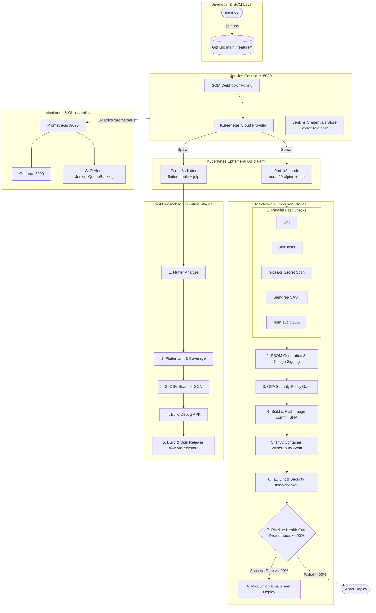

# End-to-End Pipeline Architecture: taskflow-api & taskflow-mobile

**Capstone Project:** Unified Monorepo CI/CD with Kubernetes Dynamic Agents  
**Target Architecture:** Multi-Tier Security, Automated Compliance, and Blue/Green Zero-Downtime Deployment

---

## 1. Unified Architecture Overview

---

## 2. Security & Verification Gates Matrix

| Order | Stage / Gate | Tool | Action on Failure |
|:---:|---|---|---|
| **1** | Secrets Detection | Gitleaks | Abort (Fail-Fast) |
| **2** | Static Application Security (SAST) | Semgrep | Archive SARIF, Fail on Critical |
| **3** | Software Composition Analysis (SCA) | npm audit / OSV | Evaluate in Policy Gate |
| **4** | Supply Chain Security & Attestation | Syft & Cosign | Abort if unsigned |
| **5** | Governance Policy Gate | Open Policy Agent (OPA) | Abort if OPA denies |
| **6** | Container Image Vulnerability | Trivy | Block deployment if CRITICAL CVEs |
| **7** | Infrastructure as Code (IaC) | Terraform & tfsec & Checkov | Abort plan if high severity misconfig |
| **8** | Pipeline Health Gate | Prometheus SRE Query | Abort deploy if success rate < 90% |
| **9** | Production Deployment | Kubernetes Blue/Green | Automated rollback to active color on smoke failure |
